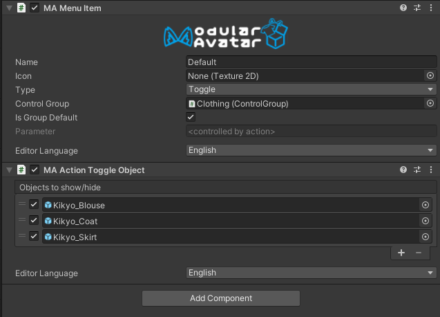

# Action: Toggle Object

The Action Toggle Object component allows you to configure a menu item to toggle on or off specific game objects.

## When should I use it?

When you want to toggle on or off specific game objects in response to an expressions menu item.

## How do I use it?

Attach an Action Toggle Object component to the same gameobject as a Menu Item component. Then, drag the gameobjects you want to toggle
onto the "objects to show/hide" section, and set the checkboxes to reflect the state those objects should have.

## Default state

If no menu item is selected as the "group default", then the initial state of these gameobjects (when no menu item is selected) will be the state of the gameobjects in the editor.
Any menu items that do not specify the state of those gameobjects will use that initial editor state.

If a menu item is selected as the "group default", then that menu item will be initially selected. When you select a different menu item, it will by default use the opposite of the group default menu item; if the group default menu item does not set the state of a menu item, then instead it'll use the initial editor state of these gameobjects.

In other words, you can build an outfit toggle by setting the "group default" to toggle ON the gameobjects responsible for the initially-active outfit, and then just specifying the gameobjects to turn ON for your other outfits. The initial outfit will automatically turn off when you select some other menu item.

## Limitations

* Only one control group (or ungrouped menu item) can toggle any particular game object.
* Traditional animators in the FX layer will take priority over Action Toggle Object; conversely, Action Toggle Object will take priority over other playable layers.