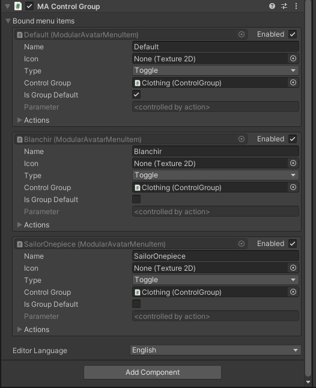

# Control Group

The control group component allows multiple toggles to be grouped so that only one can be selected at a time.

## When should I use it?

When you want to create an option that can be in one of several states - for example, an outfit switch.

## How do I use it?

The control group component itself has no configuration; simply add it to a Game Object, and point your [Menu Item](menu-item.md) components at the Control Group.
The control group can be added to any game object, as long as it's inside your avatar. Feel free to put it somewhere convenient for you.

Note that the control group is only used with menu items driving [action components](action-toggle-object.md); for traditional toggles driving animator parameters, simply set those toggles to the same parameter name. 