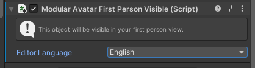

# First Person Visible

This component can be used to make a GameObject placed under the Head bone visible in first-person view.

## When should I use it?

When you want to see your own hair, or other accessories attached to your head, without needing to look in a mirror.

## When shouldn't I use it?

This component cannot be used as the child of a PhysBone chain (you can add it in the parent instead).

Using this component on _all_ children of the Head can be distracting, as your bangs continually get in the way. 

Currently, animating aspects of objects or components under a First Person Visible object is not supported.
Additionally, due to technical limitations, First Person Visible is not supported on Quest standalone.

Finally, the processing involved in this component is somewhat heavyweight, and may result in slower build times.

## Setting up First Person Visible

Just attach a First Person Visible component under a child of the Head bone. There are no configuration options to set.

The component will automatically generate a clone of the Head bone, which is connected to the real head bone using a parent constraint.
Only one constraint will be generated, even if multiple First Person Visible components are used. As such, the performance impact of this component is the same whether you use one or dozens.