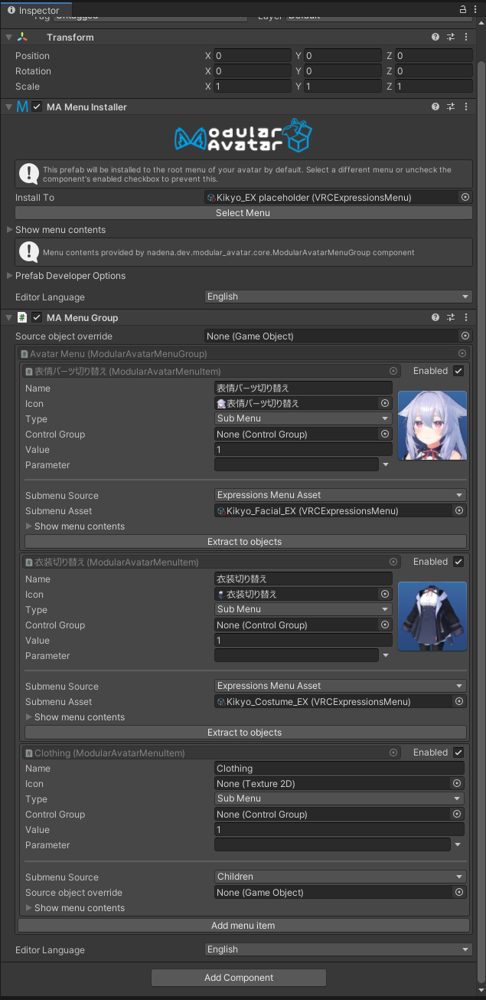

# Menu Group

The menu group component allows a single menu installer to install multiple menu items without grouping them into a submenu.
It is primarily intended as an internal component for use when converting expressions menus.

## When should I use it?

When you want to install multiple menu items without grouping them into a submenu.

## How do I use it?

The Menu Group component will by default include all Menu Items on direct children of the gameobject it is placed on.
Just as with the Menu Item submenu/children mode, you can set a source object override to select a different source object.