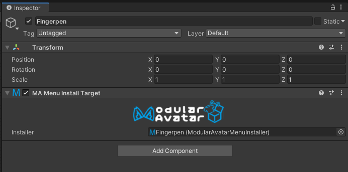

# Menu Install Target

The Menu Install Target component is a component used to support the "Select Menu" button on the [MA Menu Installer](menu-installer) component.
It "pulls" the menu from the MA Menu Installer component, and installs it based on the position of the game object it is
attached to.

## When should I use it?

Modular Avatar will create this component when necessary, when you use the "select menu" button on the
[MA Menu Installer](menu-installer) component. In most cases it is not necessary to create it manually.

## What does it do?

This component will override the target menu option on the menu installer that is selected; the menu installer will
instead act as if its menu had been copy-pasted to the location of the Menu Install Target. This allows for prefabs that
use Menu Installers to be integrated into the [object-based menu system](../tutorials/menu).