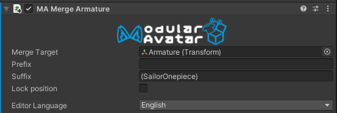

# Merge Armature

The Merge Armature component merges a tree of GameObjects onto the armature of the avatar.

## When should I use it?

The Merge Armature component is designed specifically for clothing prefabs, and includes special logic for updating existing Skinned Mesh Renderer references and minimizing the number of generated bones. You should use it if you intend to create a skinned mesh which tracks the avatar's armature.

## When shouldn't I use it?

The Merge Armature component is not designed for use in prefabs that are intended to be able to apply generically to many different avatars. It would not be a good fit for a finger-pen prefab, for example.

Because the Merge Armature component assumes that the bones you are binding to do not move, it is not able to generalize to avatars other than the one it was set up with.

## Setting up Merge Armature

After adding the Merge Armature component to the root of the source hierarchy, drag the avatar's corresponding bone (where these should be merged to) onto Merge Target. Prefix and Suffix will normally be set automatically.

## How does it work?

Merge Armature will walk the tree of GameObjects under the GameObject it is attached to, and search for the corresponding bone in the base avatar by name. For better compatibility with existing avatars, you can optionally specify a prefix and/or suffix which will be removed from the merged bones when looking for a match.
If a match is found, Merge Armature will attempt to rewrite references to the merged bone to instead point to the base avatar's corresponding bone. In some cases this is not possible, and a child bone will be created instead.
If a match is not found, a child bone will be created under the corresponding parent bone.

Merge Armature goes to a lot of trouble to ensure that components configured on the source hierarchy, or pointing to it, Just Work (tm). In particular, it will:
* Update animator references to point to the appropriate position, depending on what properties are being animated (e.g. transform animations will point to the post-merge bone, GameObject active animations will point to the source heirarchy)
* PhysBones and contacts will have their target field updated to point to the new merged bones. This will happen even if the PhysBone is not located under the Merge Armature component.
* Other components will remain on the source hierarchy, but constraints will be generated to track the merged hierarchy.

Merge Armature will leave portions of the original hierarchy behind - specifically, if they contain any components other than Transforms, they will be retained, and otherwise will generally be deleted.
Where necessary, PhysBone objects will have their targets updated, and ParentConstraints may be created as necessary to make things Just Work (tm).

As of Modular Avatar 1.7.0, it is now possible to perform nested merges - that is, merge an armature A into B, then 
merge B into C. Modular Avatar will automatically determine the correct order to apply these merges.

## Position lock mode

Position locking allows the outfit to follow the movement of the base avatar, even in edit mode. This is useful for
testing animations and poses, and for creating screenshots. There are three options for position lock mode:

* Not locked - the outfit will not follow the base avatar in edit mode
* Base =======> Target (Unidirectional) - When the base avatar moves, the outfit will move too. However, if you move the
outfit, the base avatar will not move. This mode will preserve any adjustments you've made to the outfit's fit, and is
recommended for normal use.
* Base <======> Target (Bidirectional) - When the base avatar moves, the outfit will move too. If you move the outfit,
the base avatar will move too. This mode is useful for certain advanced use cases, such as creating a prefab which
animates the base avatar's hair or animal ears.

When you set up an outfit with "setup outfit", the position lock mode will be set to "Base =======> Target
(Unidirectional)". You can change this in the inspector if desired.

## Object references

Although the editor UI allows you to drag in a target object for the merge armature component, internally this is saved as a path reference.
This allows the merge armature component to automatically restore its Merge Target after it is saved in a prefab.

## Matching bone names

Since Merge Animator will attempt to match bones by name, just attaching it won't always work to make an outfit designed for one avatar work with another avatar.
You can click the "Adjust bone names to match target" button to attempt to rename bones in the outfit to match the base avatar it's currently attached to.
This will be done automatically if you added the Merge Armature component using the "Setup Outfit" menu item.

## Avoid name collisions

Although merge armature merges bones that have names matching ones on the merge target, by default any _newly added_
bones that are unique to this new merged asset will have their names changed. This helps avoid conflicting with other
assets that also use merge armature, and which happen to have chosen the same bone name.

In some special circumstances, it can be helpful to disable this behavior. In those cases, you can uncheck the "avoid 
name collisions" box.