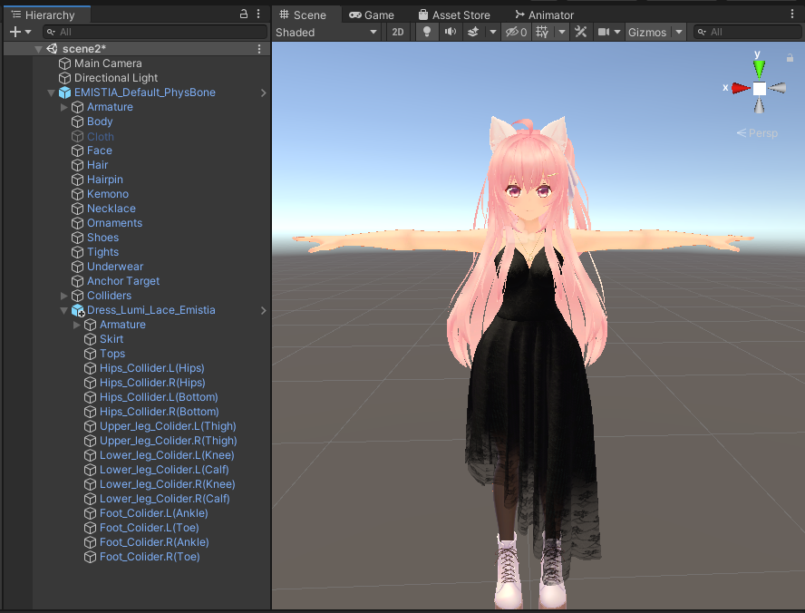

---
sidebar_position: 2
sidebar_label: Configuring a complex (cloth) outfit
---

In some cases the automatic setup is not quite enough to set up a complex outfit.
Let's look at Lachexia's [Dress Lumi](https://lachexia.booth.pm/items/3763311) as an example.

This tutorial assumes you've already gone through the [simple clothing](../clothing) tutorial,
and will skip over some of the details covered there.

We start out having dropped the Dress Lumi prefab onto the avatar, and having hidden the parts of the
original avatar's clothing that conflict with the new outfit (namely, Cloth, and setting `bra_off` on `Underwear`).

As you can see, there's a ton of extra objects in this outfit. The automatic setup described in 
the [simple clothing tutorial](../clothing) will create the Merge Armature component for us, but
the rest of the objects require a bit more setup. That being said, that's still the right place to
start:

Next up, we need to set up bone proxies to get all those collider objects to move along with their
base bones. To start, we'll select all the "Hips_Collider" objects and add an `MA Bone Proxy` to all of 
them at once. Under "Target", drag-and-drop the Hips object from the original avatar.

Note that "Attachment Mode" will automatically update to "As child; keep position" when you do this.

Go ahead and do the same for the other bones/colliers as well.　With that, the cloth colliders should work:

Finally, set up blendshape sync components for Skirt and Tops:

## Other extensions

You could fully automate the setup of this outfit, by adding a Merge Animator component which would
set up the base Body blendshapes (torso_thin => 100, elbow_off => 0, bra_off => 100), and disable Cloth.
However, this could interfere with outfit changer configurations, so it's not necessarily recommended.