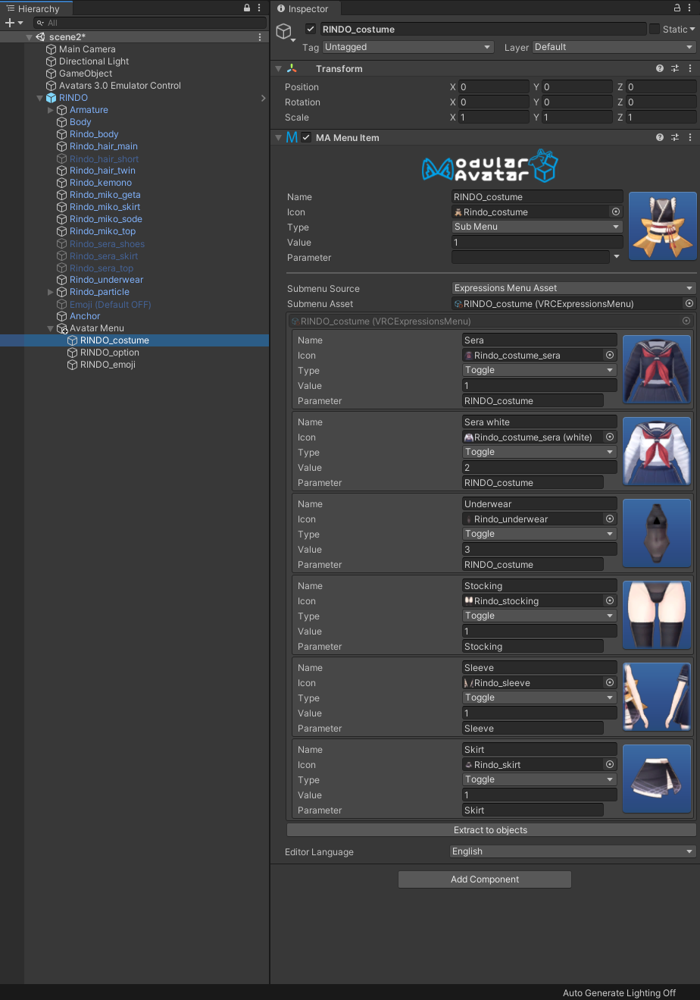
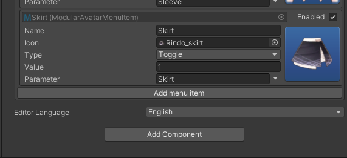
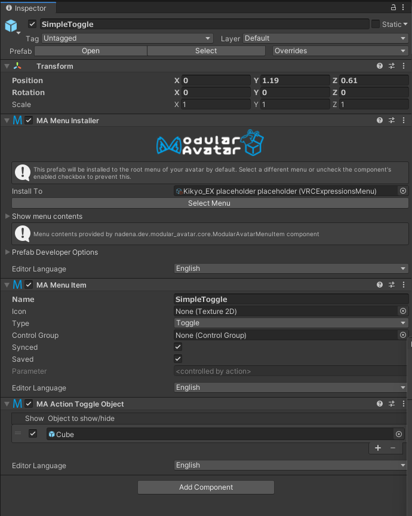
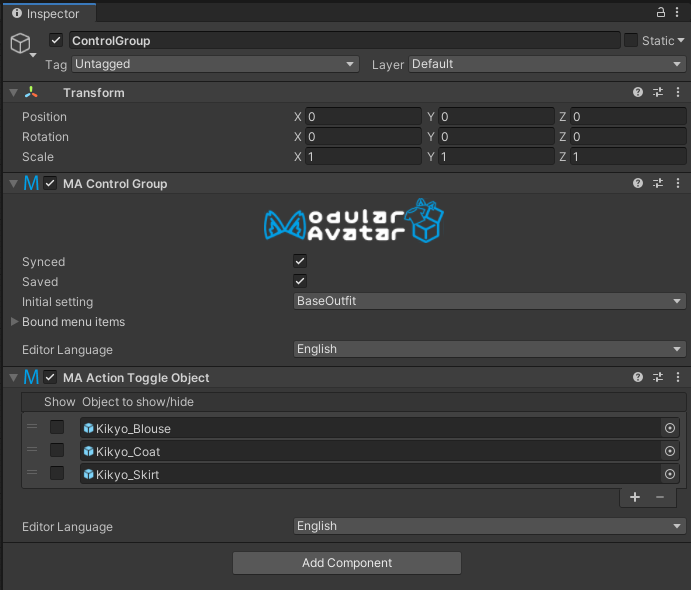

# Edit menus

Modular Avatar includes an object-based menu editing system, which lets you easily edit menus and even create simple toggles from within the Unity inspector.

This tutorial will show you how to use this system to edit your avatar's existing menus, and how to include it in your assets.

## Converting an existing avatar's menu

The easiest way to get started with the menu editor is to convert the menu on your existing avatar. Right click your avatar and select `[Modular Avatar] Extract menu`.

When you do this, a new `Avatar Menu` object will be added to your avatar, containing the top level of your avatar's menu.

As you can see, your menu items have been turned into objects. You can inspect the individual menu items as well.

You can click the "extract to objects" button here to convert this submenu as well. This will then let you see multiple levels
of your menu right in the hierarchy window.

Once extracted to objects, you can drag and drop items around to move them within your menus.

### Adding new menu items

When you've extracted a menu, you can add new menu items to it by clicking the "Add menu item" button at the bottom of the list of controls.

This will add a new menu item to the end of the list. You can then edit the name, type, parameter, etc.

To create submenus, set "Type" to "Sub Menu", then set "Submenu Source" to "Children". Then, you can click "add menu item" to add sub-items to this new menu.

### Parameters

When setting parameters, you can click the arrow next to the parameter name box to search for parameters by name. This takes into account any MA Parameters components in parent objects as well.

## Toggles

Modular Avatar also supports creating simple toggle animations directly from the hierarchy. First, let's look at a simple ON/OFF toggle.

This object is available as the "Simple Toggle" sample. As you can see, all we've done is add a "MA Action Toggle Object" to our MA Menu Item, set the menu item to "Toggle", and added the objects we want to show or hide.

The checkbox next to the cube indicates that the cube should show when the toggle is on, and hide when the toggle is off. If you clear the checkbox, then the cube will be visible when the menu toggle is off, and hidden when on.

:::tip

You can drag-and-drop objects directly to the object list to easily add them!

:::

### Multi-option toggles

In some cases you might want more complex toggles. This can be done by adding a "MA Control Group" to group the toggles. Let's look at an example.

Here we have a clothing menu which has a control group on it. The main job of the control group is to to tie together the menu items, so that only one can be selected at a time. Here's what those look like:

As you can see, each of these menu items has a "Toggle" type, and a "MA Action Toggle Object" component.
What's different here is that we've specified the control group object under "Control Group".
When you specify a control group, only one menu item out of the control group can be selected at a time. This essentially means they'll be bound to the same parameter.

The control group can be placed on any object, provided that you don't have a Menu Item on that same game object. Feel
free to put it wherever it makes sense in your hierarchy.

We've also set an additional Action Toggle Object on the control group itself. These toggles will be applied by default -
this lets us turn off the default Kikyo outfit in all of our additional outfits that we're adding.

You can select one item out of your control group to be the default item on the control group. If you select the "(none
selected)" option, then it'll be possible to turn off all toggles, selecting the control group defaults.

Finally, you can set on the control group whether the parameter is saved and/or synced.

### Limitations

This feature is in preview and has a number of limitations you should be aware of:

1. Objects can only be controlled by one control group or ungrouped toggle at this time.
2. Only GameObjects can be toggled; there is not yet support for toggling individual components, blend shapes, etc.
3. A toggle cannot both control actions and traditional animators at the same time.

These limitations will be improved on in future releases.

## Using on reusable assets

You can use the new menu item controls on reusable assets as well. Take a look at the Fingerpen or SimpleToggle assets for an example.

At a high level, if you just want to add a single control or submenu, add a MA Menu Installer and MA Menu Item on the same Game Object. The menu installer will install the menu item on the target avatar automatically.
If you want to add multiple controls to the avatar without grouping them into a submenu, you can add a MA Menu Installer and MA Menu Group. The menu group allows the menu installer to install multiple items without adding them to a submenu. This is how the extract menu system recreates the base avatar menu as unity objects. 