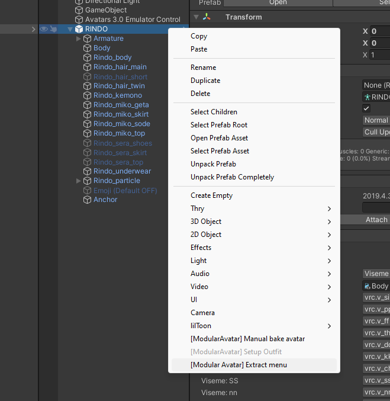
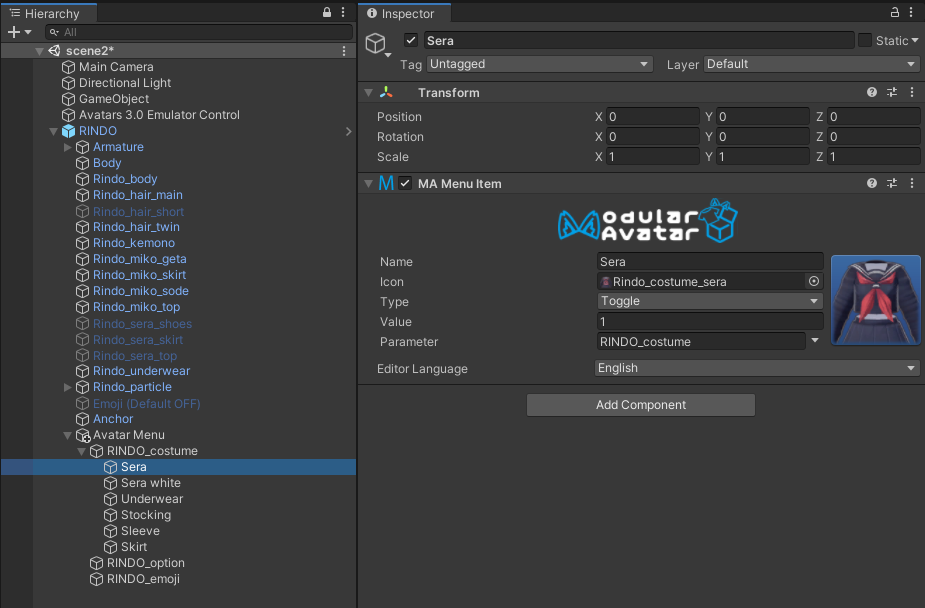

# Edit menus

Modular Avatar includes an object-based menu editing system, which lets you easily edit menus and even create simple toggles from within the Unity inspector.

This tutorial will show you how to use this system to edit your avatar's existing menus, and how to include it in your assets.

## Converting an existing avatar's menu

The easiest way to get started with the menu editor is to convert the menu on your existing avatar. Right click your avatar and select `[Modular Avatar] Extract menu`.

When you do this, a new `Avatar Menu` object will be added to your avatar, containing the top level of your avatar's menu.

As you can see, your menu items have been turned into objects. You can inspect the individual menu items as well.

You can click the "extract to objects" button here to convert this submenu as well. This will then let you see multiple levels
of your menu right in the hierarchy window.

Once extracted to objects, you can drag and drop items around to move them within your menus.

### Adding new menu items

When you've extracted a menu, you can add new menu items to it by clicking the "Add menu item" button at the bottom of the list of controls.

This will add a new menu item to the end of the list. You can then edit the name, type, parameter, etc.

To create submenus, set "Type" to "Sub Menu", then set "Submenu Source" to "Children". Then, you can click "add menu item" to add sub-items to this new menu.

### Parameters

When setting parameters, you can click the arrow next to the parameter name box to search for parameters by name. This takes into account any MA Parameters components in parent objects as well.

## Using on reusable assets

You can use the new menu item controls on reusable assets as well. Take a look at the Fingerpen or SimpleToggle assets for an example.

At a high level, if you just want to add a single control or submenu, add a MA Menu Installer and MA Menu Item on the same Game Object. The menu installer will install the menu item on the target avatar automatically.
If you want to add multiple controls to the avatar without grouping them into a submenu, you can add a MA Menu Installer and MA Menu Group. The menu group allows the menu installer to install multiple items without adding them to a submenu. This is how the extract menu system recreates the base avatar menu as unity objects. 