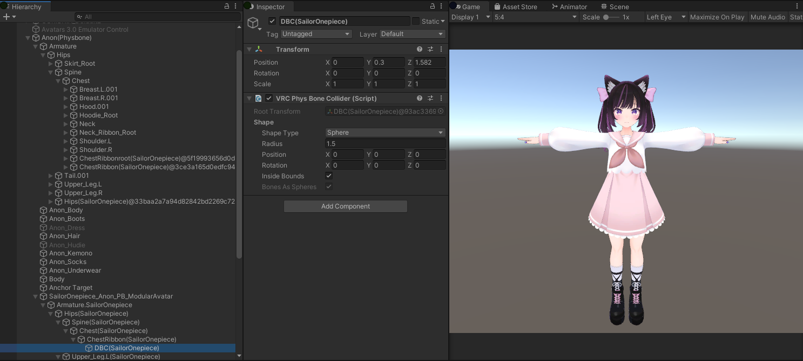
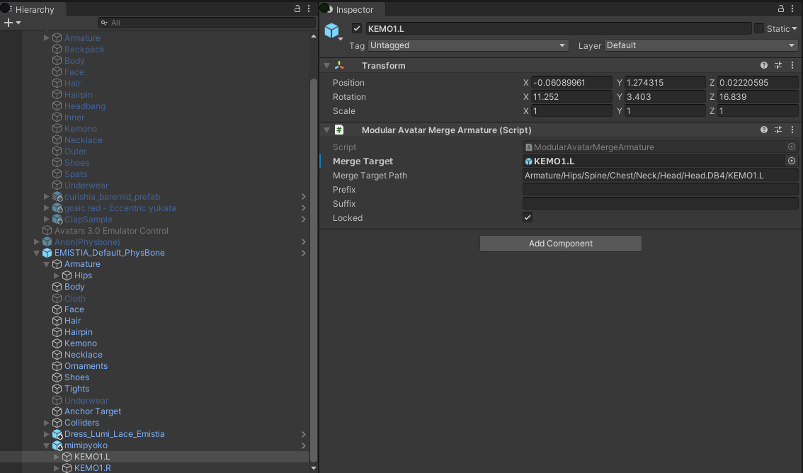

# モデュラーアバター

モデュラーアバターは、アバター設定を分割したり、アバター用ギミックや衣装を配布するための**非破壊的な**ツールキットです。
モデュラーアバターを使えば、新しい衣装やギミックの導入はドラッグアンドドロップで楽ちんです！

モデュラーアバターは現在以下の機能があります。

* 衣装導入でよくやる、プレハブのアーマチュアを親のアバターに統合すること。この過程で新規生成されるボーンを最小限にして、できる限り既存のボーンを使いまわします。
* 部分的なアニメーターを親に統合することで、様々のギミックの実装を簡単にします。

## 衣装等の統合

衣装のアーマチュアに`Modular Avatar Merge Armature`を着けることで、ビルドやプレイ時に自動的に親のアバターに統合します。結果は以下のようになります。

衣装で追加される新規ボーンのみが追加されているのがお判りでしょう。

`Merge Armature`のスクリプトは、自動的に`Merge Target`下に、自分についているボーンとその子に該当するボーンを探し当てます。
自分がついている方のボーンは、`Prefix`で始まり、`Suffix`で終わると仮定し、その補正も行います。該当するオブジェクトが見つからない場合、
アバターに新規オブジェクトとして追加します（スカートやリボン等のボーンには便利です）

衣装のON/OFFは親プレハブのON/OFFだけで済みます。そのために、PhysBonesなどのコンポーネントは統合先に移動せずに、
元の位置から統合したボーンと連動するように設定されます。PhysBonesやContactの場合は、`Root Transform`が統合先の該当アーマチュアボーンに設定されます。
そのほかのコンポーネントの場合は、必要に応じて`Parent Constrant`が生成されます。

統合の過程で、本来のアバターのアーマチュアに当てれるよう、Skinned Meshの処理（BindPose再計算）が行われます。異なる3Dソフトで作られたアバターと衣装は
これによって無事に統合できるようになります。

微調整が必要の場合は、統合前のアーマチュアを調整することができます。`Locked`のオプションを外せば、ワールド位置が保持されます
（親アバターの該当ボーンの中にボーンが配置されるような挙動になります）

## 複雑なギミックの統合

アニメーターを含んだギミックのためには、`Merge Animator`コンポーネントもあります。

このコンポーネントを着けることで、指定したアニメーターコントローラーが該当するplayable layerに統合されます。
また、`Delete Attached Animator`が有効の場合、同じゲームオブジェクトに付けられたアニメーターが削除されます。
（残しておくとアニメーション編集が楽なので）

編集しやすくするため、統合されるアニメーターのアニメションは統合前の位置でアニメーションクリップを作ってください。
つまり、`Merge Animator`スクリプトまでのパスを指定する必要はなく、その子のパスだけで済みます。

Unityの「録画モード」で、同じゲームオブジェクトに付けられるアニメーターでアニメーションクリップを作れば、自動的にいい感じになるはずです。

### アバターのどこかにオブジェクトを配置

コンタクトなど、ヒエラルキーの別の位置にオブジェクトを配置する必要がある場合があります。`Merge Armature`を使ってもいいですが、ボーン名や位置など
を合わせる必要があって、どのアバターでも適用できるギミックには最適解ではありません。

そのかわりに`Modular Avatar Proxy Bone`を使いましょう。このコンポーネントを付けることで、該当Transformが指定したボーンの位置や姿勢に連動するようになります。

追尾したいトランスフォームを`Target`にドラッグアンドドロップをすれば、後は自動的に設定されます。

ビルド時に、このProxy Boneのオブジェクトが実際のボーンの下に配備され、アニメーション参照がそれに応じて調整されます。

### ヒューマノイドボーンのアニメーション

通常のヒューマノイドアニメーションは特に特別な設定をしなくても統合アニメーターで使えます。

### 非ヒューマノイドボーンのアニメーション

ケモミミなど非ヒューマノイドボーンをアニメーションするときは、少し特別な設定が必要です。
Lockedが有効の状態の`Modular Avatar Merge Armature`コンポーネントを使いましょう。

Lockedが有効だと、元のボーンと統合ボーンが連動して動きます。つまりはアニメーションを作るときは統合前のプロクシーボーンを動かせば、
該当するアバターボーンも動くからやっていることが分かりやすいです。

ビルド時はこのプロクシーボーンが親アバターに統合されるので、パフォーマンスランクに関与しません。