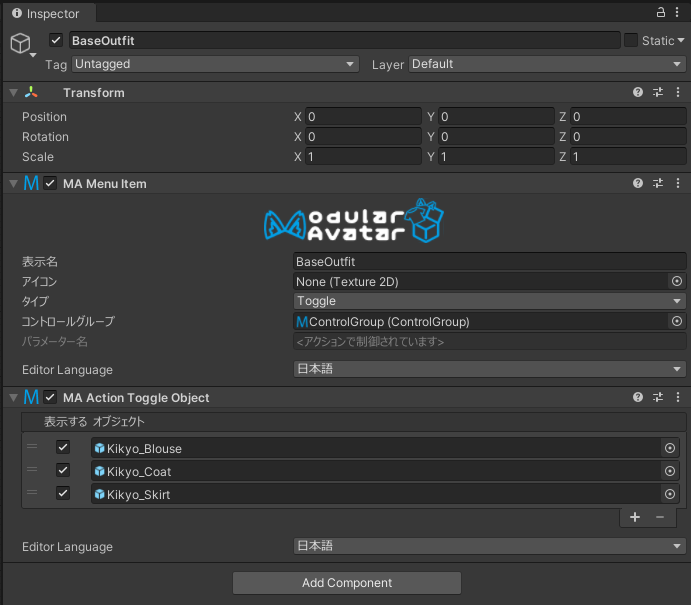

# Action: Toggle Object

Action Toggle Objectコンポーネントでは、特定のゲームオブジェクトをオンまたはオフに切り替えるようにメニュー項目を設定できます。

## いつ使うもの？

丸メニュー（Expressions Menu）の選択に応じて、特定のゲームオブジェクトをON/OFFしたいとき。

## 使い方

[Menu Item](menu-item)コンポーネントのあるゲームオブジェクトにAction Toggle Objectを追加しましょう。
そのあと、トグルしたいゲームオブジェクトをリストにドラッグアンドドロップして、非表示にしたい場合はチェックを外しましょう。

## 制限

* 特定のオブジェクトには、一つのコントロールグループ（またはグループが設定されてないMenu Item）しか操作できません。
* 通常のFXアニメーションがAction Toggle Objectより優先されます。逆に、FX以外のレイヤーだとAction Toggle Objectが優先される場合があります。