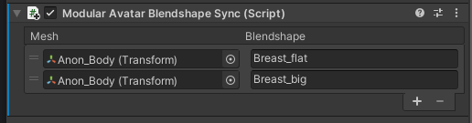

import ReactPlayer from 'react-player'

# Blendshape Sync

Blendshape Syncコンポーネントは、指定したレンダラーのBlendshapeが常に別のレンダラーと同じ値にします。

<ReactPlayer controls muted loop playsinline url='/img/blendshape-sync.mp4' />

## いつ使うもの？

アバターに体格を変えるブレンドシェープがある場合が多いです。そのようなアバターの衣装を製作、または導入していて、衣装にも同じ体格調整Blendshapeがある場合はBlendshape Syncの導入をお勧めします。

また、アバターを作っている方にも、オブジェクトを分岐してる場合、各オブジェクトの体格調整Blendshapeを合わせるためにも便利です。

## 非推奨の場合

Blendshape Syncは一つのレンダラーのBlendshapeを別のレンダラーにそのまま映します。
スケールやカーブを変える必要のある場合は非対応です。

Blendshape Syncは連鎖的に使うことができません。A→BとA→Cなら大丈夫ですが、A→BとB→Cは正しく動作しません。

At runtime, Blendshape Sync only supports syncing blendshapes that are controlled by animators. Blendshapes controlled by VRChat's builtin eyelook or viseme systems cannot be synced accurately.

プレイ中は、Blendshape Syncはアニメーターにより制御されるブレンドシェープのみを同期できます。VRChat内包の目線・口パクシステムで直接操作されるブレンドシェープが正しく同期されませんので注意。

## 設定方法

レンダラー付きオブジェクトにBlendshape Syncを追加してください。そして、+ボタンを押して選択ウィンドウを開きます。

Blendshapeをダブルクリックで同期するリストに追加してください。必要なBlendshapeをすべて追加したら、Xでエディタウィンドウを閉じます。

複数のオブジェクトを選択して、ひとくくりでの編集も対応しています。

また、Blendshapeの名前が異なる場合は、追加した後にコピー先のBlendshape名を変更できます。

### 細かい仕様

以下の二つの処理が入ります。

* エディタ上では、常に元オブジェクトからBlendshape値をコピーすることで、エディタ上でも元オブジェクトのBlendshape値の変更が直ちに反映されます。
* プレイモード、そしてアップロード時では、元オブジェクトのBlendshapeをアニメーションしている場合、そのアニメーションを調整し、同期先のオブジェクトのBlendshapeにも同じアニメーションを適用させます。