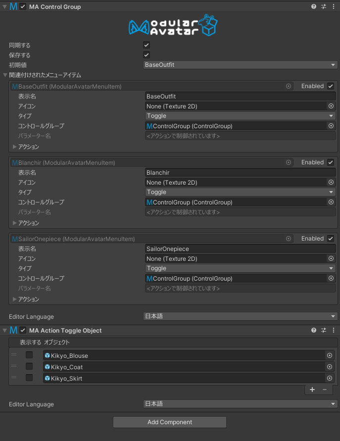

# Control Group

Control Groupコンポーネントでは、複数のトグルをグループ化して、一度に1つだけが選択されるようにできます。

## いつ使うの？

衣装変更スイッチなど、複数の状態から1つを選択できるオプションを作成する場合に使用します。

## どう使うの？

まずはGame ObjectにControl Groupを追加して、[Menu Item](menu-item.md)コンポーネントをControl Groupに向けてください。
Control Groupは、アバター内にある任意のGame Objectに追加できますが、他のMA Menu Itemと同じオブジェクトには追加できません。
わかりやすい場所に追加してください。

コントロールグループには以下の設定があります。

* 「保存する」 このオプションを有効にすると、ワールド移動やアバター変更時に、関連するトグルの現在の設定が保存されます。
* 「同期する」 このオプションを有効にすると、選択が他のプレイヤーにも同期されます。
* 「初期値」このコントロールグループの初期設定です。 「（どれも選択されない）」を選択すると、デフォルトではトグルが選択されていない状態になります。
それ以外の場合、指定したトグルがデフォルトで選択されます。 ただし、デフォルトのトグルを設定した場合、すべてのトグルを選択解除することはできません。

「関連付けされたメニューアイテム」には、このコントロールグループにリンクされているすべてのメニュー項目を確認できます。

なお、Control Groupは、[action components](action-toggle-object.md)を使用しているメニュー項目とのみ使用されます。
アニメーターパラメーターを駆動する通常のトグルの場合は、単にそれらのトグルを同じパラメーター名に設定してください。

### コントロールグループにアクションを追加

コントロールグループに[Action Toggle Object](action-toggle-object.md)などのアクションを追加できます。
これらのアクションは、特定のオブジェクトに対して何を行うかを指定しないメニュー項目を選択したときに、デフォルトとして適用されます。
例えば、衣装選択で最初の衣装をオフにすることで、それぞれの代替衣装にデフォルト衣装消し設定をいちいち追加する必要がなくなります。