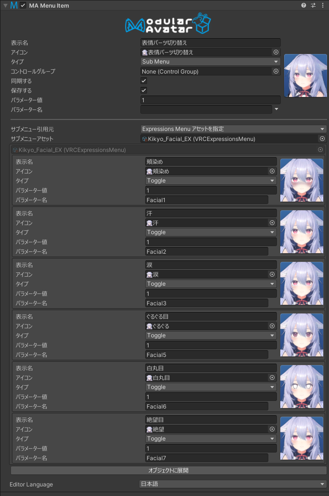

# Menu Item

MA Menu Itemコンポーネントは、Unityのヒエラルキー内でExpressions Menuのメニュー項目を定義できるようにします。

## いつ使うの？

このコンポーネントを使うことで、VRC Expressions Menuアセットで定義するよりも簡単にメニュー項目を定義できます。
ヒエラルキー内でメニュー項目をドラッグアンドドロップすることで、移動できたり、[MA Parameters](parameters)コンポーネントで定義されたパラメーター名を意識したエディターUIを提供します。
[アクションコンポーネント](action-toggle-object)と組み合わせることで、アニメーションやアニメーターを作成することなく、オブジェクトのトグルを定義することもできます。

## どう使うの？

:::tip

メニューエディターの使い方については、[こちらのチュートリアル](../tutorials/menu)をご覧ください。

:::

メニューアイテムコンポーネントは、メニュー内の単一の項目を定義します。
アイコン、メニュータイプ、[コントロールグループ](control-group)、パラメーターなどを設定できます。
メニュー項目の名前は、ゲームオブジェクトの名前から取得されます。これでヒエラルキーからメニュー項目の名前を確認したり、名前を変更したりできます。

### サブメニューについて

メニュー項目をサブメニューとして設定すると、サブメニューの内容をどこから取得するかを設定できます。
サブメニューの引用元を「Expressions Menu アセットを指定」に設定し、通常のVRC Expressions Menuアセットを参照するか、
サブメニューの引用元を「子オブジェクトから生成」に設定し、このメニュー項目の直下にあるメニュー項目をサブメニューとして使用することができます。

サブメニューの項目数がVRCメニューの最大項目数を超える場合、自動的に「次へ」項目が作成され、メニューが分割されます。

サブメニューの引用元を「子オブジェクトから生成」に設定した場合、「引用元オブジェクト」を指定することもできます。指定する場合は、Menu Itemが追加されてるオブジェクトの子ではなく、指定したオブジェクトの子オブジェクトが使用されます。

### メニューの配置

メニュー項目をどこに配置するかを定義するために、他のコンポーネントを使用して配置させる必要があります。これは3つの方法で行うことができます。

* 「子オブジェクトから生成」モードでサブメニューを設定したメニュー項目の子に配置する。
* [Menu Installer](menu-installer)コンポーネントがあるゲームオブジェクトにメニュー項目を配置する。
* メニュー項目を[Menu Group](menu-group)オブジェクトの子に配置する（Menu Installerコンポーネントがあるゲームオブジェクトに配置される場合が多い）。

配置されないメニュー項目は効果がありません。

### Actionと併用

メニュー項目と同じオブジェクトに[アクションコンポーネント](action-toggle-object)がある場合、メニュー項目は任意のパラメーターを制御するのではなく、このアクションコンポーネントを制御するように設定されます。詳細については、[アクションコンポーネントのドキュメント](action-toggle-object)を参照してください。

同じオブジェクトにアクションコンポーネントがある場合、メニュー項目のパラメーター名を選択できなくなります。その代わりに、Modular Avatarはビルド時にパラメーターを自動的に割り当てます。デフォルトでは、ブールパラメーターが作成されます。メニュー項目に[コントロールグループ](control-group)をアタッチすると、intパラメーターが使用されます。