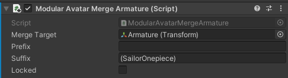

# Merge Armature

Merge Armatureコンポーネントは、GameObjectのツリーをアバターのアーマチュアに統合するコンポーネントです。

## いつ使うもの？

Merge Armatureは衣装アセット専用のもので、Skinned Mesh Rendererの調整や追加されるボーンを最小限にする特殊処理が入っています。
アバターのアーマチュアに追従するスキンメッシュを追加するときに使いましょう。

## 非推奨の場合

様々なアバターに対応する、汎用アセットには不向きです。例えば汎用型指ペンアセットは推奨できません（その代わりに[Bone Proxy](bone-proxy.md)を使いましょう）
元々想定したアバター以外には対応できないアセットとなります。

## セットアップ方法

統合させるヒエラルキーのルートにMerge Armatureコンポーネントを追加して、アバターの方の該当ボーン（統合先）を「統合先」に置きましょう。
「前置詞」「後置詞」は自動的に設定されます。

## 細かい仕様

追加されたGameObject以下のツリーをたどり、統合先の所から該当ボーンを名前で探します。
既存アセットの互換性を上げるため、統合先を探すときにはがされる前・後置詞も指定できます。

該当ボーンが見つかった場合は、統合元ボーンへの引用を統合先ボーンへ書き換えようとします。できない場合は、子にボーンが追加されます。
また、該当ボーンがない場合も、子にボーンが追加されます。

元々のヒエラルキーに設定されたコンポーネントがそのまま動作できるようにいろいろと工夫しています。特に、
* アニメーター引用が自動的に必要に応じて統合先に書き換えられます。Transformアニメーションは統合先に向かれたり、GameObjectのON/OFFがもともとの位置だったり。
* PhysBonesやContactはTarget欄が統合先のボーンに書き換えられます。PhysBone自体がMerge Armatureの外でもこの処理が施されます。 
* 他のコンポーネントは元々の位置のままで、コンストレイントで統合先の動きに追従します。

Transform以外のコンポーネントが入っているボーンがある場合、そのボーンが残ります。そのほかのボーンは原則として統合後に削除されます。
必要に応じてPhysBoneのターゲットが調整されたり、ParentConstraintが生成されることで、なんとなく動くようになります。

## 位置を固定

位置を固定を設定すると、統合先のボーンがエディタ上で元のボーンと同じ位置になります。これは総合的な関係で、どちらかのボーンが
動けばもう片方が動きます。

非・ヒューマノイドボーンのアニメーションを作る想定の機能です。たとえば、これでケモミミを動かすアニメーションを作ることができます。

## オブジェクト引用

エディタ上では統合先をドラッグアンドドロップで指定しますが、内部ではパスで保存されます。プレハブ化してもちゃんと統合先を保存できるということです。

## ボーン名合わせ

Merge Animatorがボーンを名前で照合するので、つけるだけでは非対応衣装がうまく動かない場合があります。
対策として、「ボーン名を統合先に合わせる」ボタンを押すことで、衣装側のボーン名を自動的にアバターのボーン名に合わせようとします。
なお、「Setup outfit」でMerge Armatureをつける場合はこの処理が自動的に走ります。