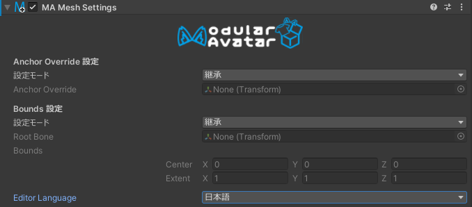

# Mesh Settings

Mesh Settingsコンポーネントを使用すると、特定のゲームオブジェクトの配下にあるすべてのメッシュに対して、特定のメッシュ設定
（アンカーオーバーライドとバウンズ）を設定できます。

## いつ使うべきか

このコンポーネントをアバターの最上位レベルに配置すると、アバター内のすべてのメッシュに対してバウンズとライトプローブアンカーが
一貫して設定されるようになります。

「Setup Outfit」機能は、新しく追加されたアウトフィットに自動的にMesh Settingsコンポーネントを自動的に設定します。

最後に、Mesh Settingsは、階層の上位にあるMesh Settingsの影響を受けないように、メッシュを除外するためにも使用できます。

## いつ使うべきでないか

配布用のアセットにバウンズやライトプローブを設定する時は注意が必要です。なぜなら、これらの設定がアバターと一致しない可能性が
あります。一般的に、特定のアバター用に設計されたアセットの場合のみ設定を推奨します。

## Mesh Settingsの手動設定

ゲームオブジェクトにMesh Settingsを追加すると、最初は何も効果がありません。Anchor Overrideの設定モードまたはBounds Override
の設定モードを「設定」に設定することで、そのゲームオブジェクトの下にあるすべてのメッシュのアンカーオーバーライドまたはバウンズ
を設定できます。また、モードを「設定しない」に設定することで、これらのメッシュを階層の上位にあるMesh Settingsの影響から除外できます。

バウンズを設定する場合、バウンディングボックスは「Root Bone」として指定したトランスフォームに対して相対的に決定されます。
また、バウンズはSkinned Mesh Rendererのみに影響しますが、Anchor OverrideはMesh RendererやLine Rendererなどの他のタイプの
Rendererにも設定されます。