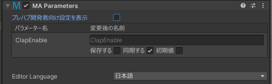
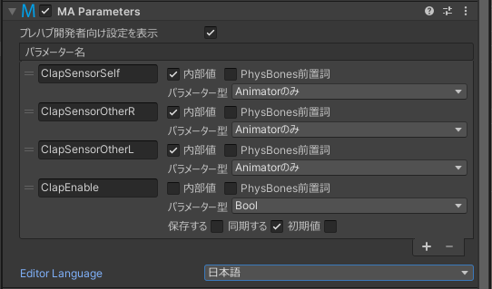

# Parameters

The Modular Avatar Parameters component allows you to define the animator parameters your prefab uses either internally, or to communicate with other components.
It allows the end-user to easily rename parameters to avoid conflicts, or to wire up multiple prefabs without having to alter animators directly.
It also allows for automatic configuration of synced parameters.

The Parameters component has two display modes: One for end-users of prefabs, and one for prefab developers.
End-users can rename fields, and configure their AV3 parameters settings (saved state and default value).
Developers can adjust the sync type and set parameters to be internal/hidden from end-users.

 

## When should I use it?

The Parameters component should be used when you're building a prefab which makes use of animator parameters other than VRChat builtins.

## How do I use it?

### End-users

The parameters component on prefabs can be used to rename parameters to avoid conflicts, and to adjust whether synced parameters are saved across avatar reloads (and their default value).
By renaming multiple prefab parameters to be the same, you can make them all share the same state and animate at the same time.
Alternately, by changing conflicting names to be different, you can resolve prefab conflicts.

### Prefab developers

Add the parameters component to the root of your prefab, and click "Show Prefab Developer Options". You'll see a list of all parameters used in your prefab.

Each parameter can be configured with the following options:

* Internal - Hides the parameter, and automatically renames the parameter with a unique name.
* PhysBones Prefix - Indicates this is a parameter passed to a PhysBone "parameter" field (and thus it really references a number of sub-parameters)
* Sync Mode - Indicates if a parameter is synced, and if so what its type is

Parameters components can be nested. This lets you build up a complex prefab out of sub-prefabs, some which may be added multiple times, and while avoiding parameter name conflicts.

Parameter renaming will be applied to the following components underneath (or on the same GameObject as) the Parameters component:
* [Modular Avatar Merge Animator](merge-animator.md)
* [Modular Avatar Menu Installer](menu-installer.md)
* VRC Physics Bone
* VRC Contact Receiver
* Animator (although this is unlikely to be very useful)
