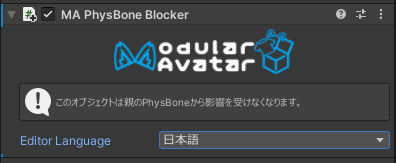

# PhysBone Blocker

PhysBone Blockerは、子オブジェクトから親オブジェクトをルートとするPhysBoneの影響を防ぎます。
親オブジェクトを影響するPhysBoneコンポーネントのIgnoreリストに子オブジェクトを追加することにより実装しています。

## いつ使うもの？

PhysBoneによる揺れ物、例えば耳やしっぽにつけるアクセサリーを作るとき、PhysBone Blockerを付けることで
既存の親のPhysBoneの影響を防ぐことができます。

なお、PhysBone Blockerを付けた子オブジェクトでも、そのオブジェクトそのものにPhysBoneを付けることが可能です。

## Bone Proxiesとの使用

[Bone Proxy コンポーネント](bone-proxy.md)を使って、既存のPhysBoneチェーンに装着するとき、
PhysBone Blockerも付けるとしっかりと親に固定できます。この時はPhysBone BlockerをBone Proxyと同じオブジェクトに付けることを推奨します。