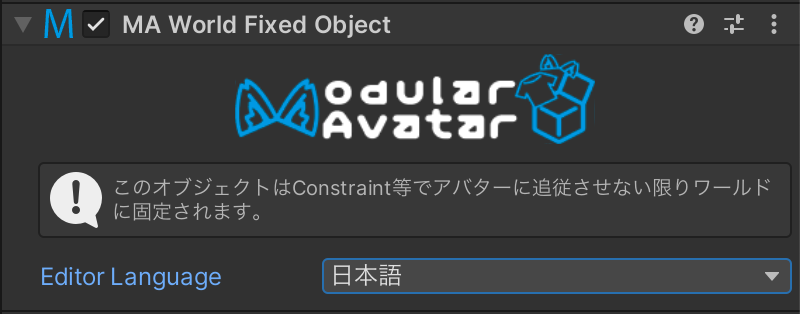

# World Fixed Object

このコンポーネントを付けることで、GameObjectをワールドに固定できます。

## When should I use it?

GameObjectをワールド固定したいとき。

## When shouldn't I use it?

## Setting up World Fixed Object

ワールド固定したいGameObjectにWorld Fixed Objectコンポーネントをつけるだけです。設定はありません。

このコンポーネントは自動的にワールド原点に固定されたGameObjectをアタバー直下に作り、その子にWorld Fixed ObjectのついたGameObjectを移動させます。
World Fixed ObjectのついたGameObjectはParent Constraint等を使用してワールド内の位置を調整できます。

複数のWorld Fixed Objectコンポーネントを使っても、Constraintは一つだけです。なので、複数のGameObjectを指定しても、その分重くなることはありません。

技術的な制約により、Quest単体では動作できません。Quest向けのビルドはつけたままにしてもいいが、効果は発揮しません。
