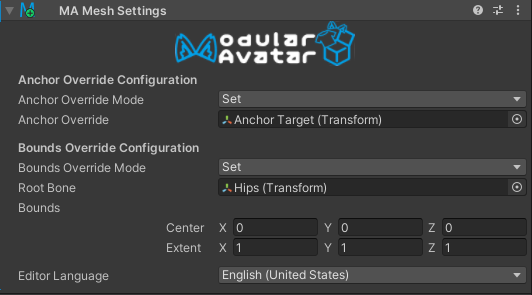
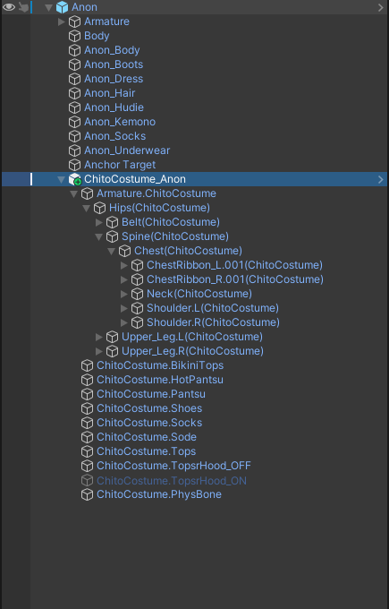
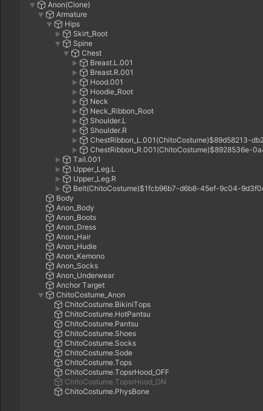
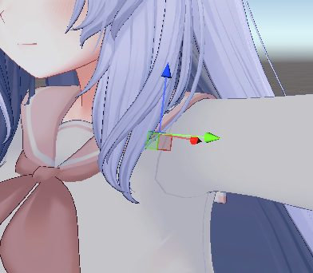
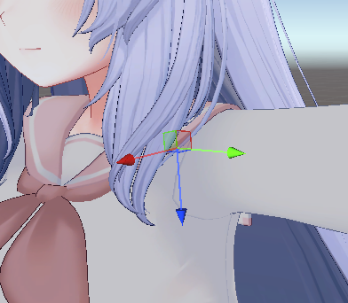
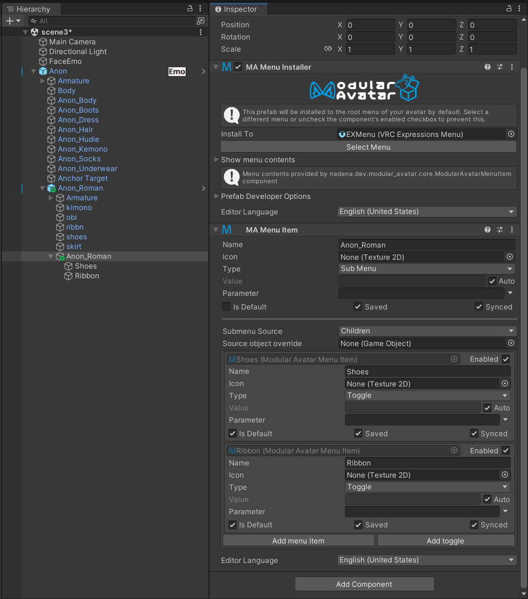

# Advice for Outfit Creators

This page is intended to provide an overview for creators of outfits who want to ensure that their outfits are
compatible with Modular Avatar. Generally, Modular Avatar has been designed to work with pre-existing conventions
seen in outfits designed for avatar use, but there is the occasional outfit which does something a bit different.
This page may help you understand what Modular Avatar expects, and how to ensure that your outfit works with it.

## tl;dr

For "modular avatar compatible" outfits, just make sure Setup Outfit works. For "Modular Avatar Preset" outfits,
run "setup outfit" ahead of time, and also consider setting up:

- Blendshape Sync (to sync body-shape-altering blendshapes from the base avatar)
- Shape Changer (to shrink or hide parts of the base mesh when parts the outfit is enabled)
- Menu Items and Object Toggle (to allow users to toggle parts of the outfit on/off)

## Compatible vs Preset

Before we get started, we should clarify that there are two different levels of support for Modular Avatar. At the
minimum, you can ensure that the bone naming conventions and placement of PhysBones components are compatible with
what Modular Avatar expects, making your outfit "Modular Avatar Compatible". Most outfits will naturally end up
compatible, but this document will walk you through the detailed requirements, in case you're having trouble.
Modular Avatar Compatible outfits don't actually have any Modular Avatar components, so you don't _need_ to use
Modular Avatar to install them, and can use some other outfit installation system instead (or do it manually, of
course).

You can go a step further and provide a prefab with Modular Avatar components already set up, which we call a
"Modular Avatar Preset". This can let you provide additional features for your customers, and reduce the steps needed
to set things up and the risk for mistakes being made. For example, you can set up blendshapes to automatically sync
with the base mesh, and/or hide parts of the base mesh that are covered by clothing. However, doing so will require
that your customers have Modular Avatar installed to use your prefab. You can of course prepare multiple prefabs, one
with Modular Avatar components and one without, to cater to both audiences.

Please note that "Modular Avatar Compatible" outfits are not eligible for using the Modular Avatar logo. See the
[Logo Usage guidelines](../logo-usage.md) for details.

## How to check for compatibility/debugging tips

Before we dive in, let's look at the typical workflow for setting up a "Modular Avatar Compatible" outfit. Most users
will put the outfit inside the avatar GameObject, then right click and choose `Modular Avatar -> Setup Outfit`. If
successful, the necessary Modular Avatar components will be added and the avatar will be ready to go.

To check that everything is set up properly, there's a few options:

### Edit mode sync

When you setup outfit, the outfit will be configured to sync with the base avatar's bones in edit mode. Rotate some
of the base bones to verify that the outfit is following it properly.

### Testing in play mode

Modular Avatar will merge the avatar in play mode, so you can see how it'll look at upload time. You can use tools like
Avatar 3.0 Emulator or Gesture Manager to get a more accurate preview.

### Manual Bake

You can also have Modular Avatar simply process the avatar in edit mode, and show the results. Just right click the
avatar and choose `Modular Avatar -> Manual Bake Avatar`. A clone of the avatar will be created with the outfit
applied, and you can see how it turned out.

## Setup Outfit

### How does it work?

Setup Outfit is generally designed to work with most pre-existing outfits, and to set things up with reasonable
defaults. Let's take a closer look at what it does:

#### Identify bones

  
  *The highlighted portions of the bone names are compared by Setup Outfit to locate the outfit's bones.*

Setup Outfit first tries to locate certain bones in the outfit, which it uses as a reference point
for processing. Specifically, it looks for a bone that looks like `OutfitRoot -> [Armature] -> Hips`, where `Hips` needs
to contain the name of the base avatar's hip bone. It's OK for some additional text to come before and after the hips
bone name, but that needs to be consistent across all bones in the outfit. Note that the `Armature` game object can have
any name.

If the outfit's bone naming does not conform to these rules, Setup Outfit will try to match the bone names in the outfit
and avatar against a list of common bones names, and if successful, will rename the outfit bones to match the base
avatar. It's best to avoid this mode as it can be less reliable; we recommend matching the outfit bones to the base
avatar precisely.

#### T-pose/A-pose conversion

  

Sometimes, outfits and base avatars might not be in the same pose. This can be the case if the avatar was modeled in a
T-pose, but the outfit was modeled in an A-pose. Setup outfit will rotate the arms to match their _positions_ to the
base avatar.

#### Creating a Merge Armature component

  

Setup Outfit will create a Merge Armature component, on the armature object. This component will contain the text
that came before/after the bone names identified in the previous step (the prefix and suffix), as well as a reference
to the avatar armature. This is what actually merges the bones onto the base avatar.

Setup Outfit has some logic to try to deal with outfits that might have an upper chest bone that is not in the base
avatar as well; this is handled by using multiple Merge Armature components.

Merge Armature will attempt to avoid creating duplicate bones; it'll merge the outfit bones into the base avatar where
possible. In particular, bones which contain components (other than Transform) will _not_ be merged, and will instead
be moved to be a child of the corresponding base avatar bone.

#### Creating a Mesh Settings component

  

Setup Outfit will also create a mesh settings component. This will configure a default light probe anchor, set to be
consistent with the base avatar's meshes, and a reasonable bounding box, for all meshes in the outfit.

### Before/after

Here's an example of an outfit before and after merging:

  
  *Before merging*

  
  *After merging*

As you can see, most of the outfit bones have been merged, but some remain due to PhysBones configurations. Any bones
not
present in the base avatar are also preserved. The additional text after each bone name avoids name collisions when
multiple outfits are added.

### Animation corrections

Merge Armature performs a number of adjustments to animations in the avatar. In particular, it:

- Adjusts animation paths to correspond to moved bones
- Arranges for animations that toggle on/off the original outfit as a whole to toggle on/off all of the objects from
  that outfit, after they've been scattered throughout the avatar.

This means that users can usually just use whatever animation setup tool they prefer to toggle on/off outfit root
objects, and this will automatically turn on/off not only the meshes, but also any PhysBones components as well.

### Differences from Bone Proxy

If you're familiar with Bone Proxy, you might be wondering how Merge Armature differs. Bone Proxy differs in a few ways:

- Bone Proxy moves a single object to be under another object somewhere in the avatar. It does not merge bones at all.
- If you target a humanoid bone with Bone Proxy, it will do so in a way that does not depend on the name of the bone.
  This allows you to create generic gimmicks that work with any avatar.
- Bone Proxy lets you select how position and rotation is handled with the object; you can have an object snap to the
  avatar's hands, for example, regardless of where they are.
- Bone Proxy does not perform the same adjustment of on/off animations as with Merge Armature; while it'll correct
  animation paths, animations which toggle the parent of the Bone Proxy on/off won't affect the bone proxy object and
  its children.

Bone Proxy can be useful when you're creating an accessory that targets a single bone. For example, a hairpin could use
a Bone Proxy locked to the Head bone. This would make it easier to use on different avatars than it was originally set
up with.

### Things that are OK to do

There are a number of things that Setup Outfit and Merge Armature support that might be surprising. Here are a few
examples.

#### Prefixes and suffixes

As mentioned before, you can put a prefix or suffix before/after bone names. This is OK as long as you use exactly the
same prefix or suffix on all merged bones. Any bones that don't have this prefix or suffix won't be merged with base
avatar bones. Note that uppercase and lowercase matters here.

#### Different bone axis

  

    
    
*Base avatar shoulder*

  

  

    
    *Outfit shoulder*
  

Different 3D modeling software can use different axis conventions; sometimes the X axis will stick out of the shoulder,
sometimes it might be Y or Z. Merge Armature will handle this automatically; it's not necessary to match the base avatar
in rotation, as long as the position matches.

#### Armature object naming

Setup Outfit doesn't actually care what the `Armature` object (parent of the hips object) is named. It's just looking
for the outfit hips.

#### A vs T pose conversion

It's OK for your outfit to have a different arm pose than the base avatar. If you do this, there are some important
notes:

- A/T pose conversion will only happen if your arm lengths are exactly the same as the base avatar. If the length
  differs
  by more than a tiny amount, this conversion will be skipped.
- Setup Outfit determines the direction to rotate based on the difference in bone positions. Thus, if your bone
  positions
  are off slightly, it might result in unwanted rotation.

### Things to avoid

#### PhysBones on humanoid bones

Some outfits have VRC PhysBones components on humanoid bones, such as hips or chest. This is not recommended; while it
can work in some cases, there are a number of outfits that accidentally have PhysBones that are copied from the base
avatar, and Modular Avatar tries to delete these in this case. This can result in unpredictable behavior.

What is recommended here is to ensure that any PhysBones components are on GameObjects that either are not present in
the base avatar, or are outside of the Merge Armature component's game object. This will ensure consistent behavior.

#### Exactly the same naming as the base avatar

If all of your bones, as well as the Armature object, have _exactly_ the same names as the base avatar, this can trigger
some annoying Unity bugs. Setup Outfit tries to avoid this by renaming the Armature object, by adding a `.1` to its
name.
However, it's best to just avoid this from the start; renaming either the armature object or the hips object will avoid
these issues.

## Modular Avatar Presets

Now that we've talked about the minimum requirements for supporting Modular Avatar, let's talk about what it means to
have a Modular Avatar preset. Typically, this means you've prepared a prefab where Setup Outfit is already run. Your
customers can now simply add this prefab to their avatar, and the outfit will be ready to do. It's OK if they run Setup
Outfit again; it'll see that things are already configured and skip processing.

Outfits configured this way may be eligible to use the Modular Avatar logo in their advertising. See the [Logo Usage
Guidelines](../logo-usage.md) for detailed requirements.

You can however go a step further and set up additional things to make things more convenient for your customers.
Here's some examples.

### Blendshape Sync

Some avatars have blendshapes which change the size of various portions of the body. You can use the Blendshape Sync
component to automatically adjust the outfit's blendshapes to match those of the base avatar. This can be useful for
breast size blendshapes, for example.

### Shrink/hide shapekeys

Many avatars have shape keys which can be used to shrink and hide parts of the base mesh, to avoid clipping into the
outfit. Modular Avatar has a feature which can be used to automate this process. By configuring the
[Shape Changer](../../reference/reaction/shape-changer.md) component, Modular Avatar will automatically
shrink or hide shape keys
when the corresponding object is enabled. This will also respond to animations which turn on/off parts of the outfit,
and can even outright _delete_ portions of the mesh, if the Shape Changer object is always enabled.

### Object Toggles

Many outfits have different parts that can be turned on and off. You can set up a menu for your users to use ahead of
time by configuring `Object Toggle`s. Take a look at [the Object Toggle tutorial](../../tutorials/object_toggle/index.md)
for details on how to set these up.

You can then combine these into a single submenu; to do this, set up an object as the parent of your toggles that looks
like this:

