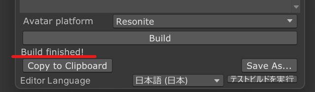

# Resonite support

Modular Avatar has experimental support for building avatars for Resonite.

## Pre-Build

building avatars for resonite requires `Modular Avatar - Resonite support` / `Microsoft .NET Runtime 9.0`.

### Modular Avatar - Resonite support

1. [Add pre-release repogitory](../intro.md).
2. Afterward, open "Manage Project" for your project, click the + next to `Modular Avatar - Resonite support`, and then click `APPLY`.

After install it, [enable experimental features](../experimental-features).

### Microsoft .NET Runtime 9.0

1. Click `Search` at the bottom of Windows, taskbar. enter `terminal` , then click `Terminal App`.
2. Enter `winget install Microsoft.DotNet.Runtime.9`, then press `Enter`.
3. If the terms of use are displayed, enter `Y` and press Enter to proceed.

## Build

Follow the steps below to build an avatar for Resonite.

1. Open the NDMF console (Tools -> NDM Framework -> NDMF Console)
2. Select the avatar at the top of the window
3. Select `Resonite` under `Avatar platform` at the bottom of the window
4. Click Build

When the build is completed successfully, the message `Build finished!` appears at the bottom of the NDMF Console.

:::tip

If you get an error, click on the `Console` tab and look at the bottom for a **red exclamation mark**.
:::

Once the build is complete, install it into Resonite. There are two ways to install it:

1. Click "Copy to Clipboard" and then click `Paste content from clipboard` from the Resonite dash menu.
2. Click "Save as..." to save the avatar file as a Resonite Package, then drag and drop it into Resonite.

Modular Avatar has experimental support for building avatars for Resonite.
Enabling this feature requires that you install the "Modular Avatar - Resonite support" package using ALCOM,
and that you enable [experimental feature support](../experimental-features).

To build an avatar for resonite, open the NDMF Console (Tools -> NDM Framework -> NDMF Console), select your avatar at the top of the window, select "Resonite" as the "Avatar platform", and click build.
If all goes well, you'll see a "Build finished!" message. You can then either "copy to clipboard", and then hit Ctrl-V in resonite, or click "Save as..." to save the avatar as a `resonitepackage` file.

The resonite build process will automatically copy certain avatar features, such as visemes, eye position, and physbones/dynamic bones to the Resonite avatar.
If you've already set up your avatar for VRChat, no additional configuration is needed. If your avatar is not set up
for VRChat, or if you don't have the VRCSDK installed, refer to the documentation on [portable avatar components](./portable-avatar-components.md)
for more information on how to set up your avatar.

## Supported features

| Feature | Supported | Limitations |
| ------- | --------- | ----------- |
| Avatar viewpoint | ✅ | None |
| Visemes | Partial | Blendshape visemes only |
| Dynamic bones | Partial | See below |
| Reactive Components | ⌛ | Planned |
| Unity Constraints | ⌛ | Planned |
| Protection against showing partially-loaded avatars | ✅ | None |

## Supported MA components

| Component | Supported | Limitations |
| ------- | --------- | ----------- |
| Blendshape Sync | ⌛ | Planned |
| Bone Proxy | ✅ | None |
| Convert Constraints | ✖ | VRChat only |
| Menu Group | ⌛ | Planned |
| Menu Install Target | ⌛ | Planned |
| Menu Installer | ⌛ | Planned |
| Menu Item | ⌛ | Planned |
| Merge Animator | ✖ | VRChat only |
| Merge Armature | ✅ | None |
| Merge Blend Tree | ✖ | VRChat only |
| Mesh Settings | ⌛ | Planned |
| MMD Layer Control | ✖ | VRChat only |
| Move Independently | ✅ | None |
| Parameters | ⌛ | Planned (will be converted to DynVars) |
| Physbone Blocker | ✅ | None |
| Remove Vertex Color | ✅ | None |
| Replace Object | ✅ | None |
| Scale Adjuster | ✅ | None |
| Sync Parameter Sequence | ✖ | VRChat only |
| Visible Head Accessory | ⌛ | Planned |
| VRChat Settings | ✖ | VRChat only |
| World Fixed Object | ⌛ | Planned |
| World Scale Object | ⌛ | Planned |

## Dynamic bones

Modular Avatar will detect dynamic bones created using either [Portable Dynamic Bones](./portable-avatar-components#portable-dynamic-bones) or VRChat's PhysBones, and attempt to convert them to Resonite's dynamic bones, including any colliders.

Since Resonite has its own dynamic bone system, most configuration options are not converted.
However, exclusions (including Physbone Blockers), colliders, collision radius, and grabbability are converted.

Modular Avatar will group Dynamic Bones into a number of named "templates" based on their bone names.
You can override the template name by either adding a portable dynamic bone component with a group name specified. Alternately, in resonite, you can create a new template by cloning an object under the `Avatar Settings` -> `Dynamic Bone Settings` Slot, setting its name to the new template name,  and then changing the name found on the `Template Name` slot underneath the slot that defined the dynamic bone.

All dynamic bones under the same template will share the same settings for Inertia, InertiaForce, Damping, Elasticity, and Stiffness; you can change these settings on any of the dynamic bones in question,and any changes will be reflected on all of them.

## Avatar Settings copier

Modular Avatar will set up a system for copying avatar settings between different versions of your Resonite avatar. This lets you set resonite-specific settings, such as dynamic bone settings, and then copy them to a new version of your avatar after reimporting from unity.

This feature will specifically copy all Slots underneath the `Avatar Settings` slot, overwriting
any existing slots with the same name. You can add your own slots to the `Avatar Settings` slot, and they will be copied as well.

To copy settings, wear your old avatar in resonite, and pick up your new avatar with your laser. From the context menu, select `MA Settings Copier` -> `Copy To Avatar`. This will copy the settings from your old avatar to your new avatar. You can then wear the new avatar, and the settings will be applied.

## Default DynVars

Modular Avatar defines a number of default Dynamic Variables that can be used by avatar systems.

Some of these dynvars are still somewhat experimental, and may change in the future.

| Name                                   | Type | Description |
|----------------------------------------| ---- | ----------- |
| `modular_avatar/AvatarRoot`            | `Slot` | The root slot of the avatar (parent of `CenteredRoot`) |
| `modular_avatar/AvatarWorn`            | `bool` | Whether the avatar is currently worn (detected by the avatar being a direct child of the User slot) |
| `modular_avatar/AvatarSettingsRoot`    | `Slot` | The `Avatar Settings` object |
| `modular_avatar/AvatarPoseNode.[type]` | `Slot` | The Slot containing the `AvatarPoseNode` component for node `[type]` (e.g. `Head Proxy`) |
| `modular_avatar/MeshNotLoaded`         | `bool` | _False_ if there are any unloaded meshes in the avatar, _missing_ otherwise. _This dynvar is subject to change in the future._ |
| `modular_avatar/HumanBone.[name]`      | `Slot` | References a humanoid bone by name. _Name is subject to change in the future._ |
| `modular_avatar/HumanBonePose.[name]`  | `float4x4` | The initial pose of the bone referenced by `BoneRef_[name]`. _Name is subject to change in the future. Values might not be quite correct yet._ |

Additionally, an `Avatar` Dynamic Variable Space is created on the avatar root for use by other gimmicks.

<!-- TODO: Screenshots -->