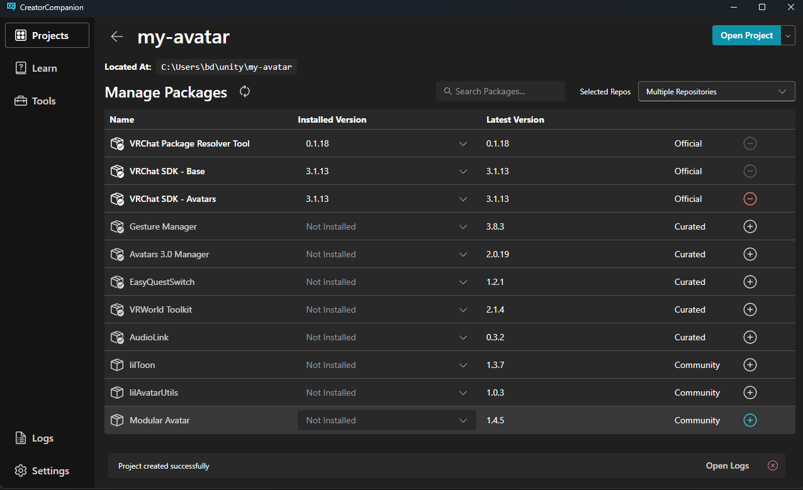
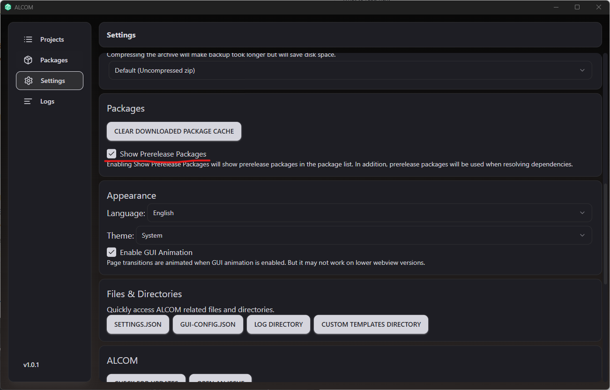
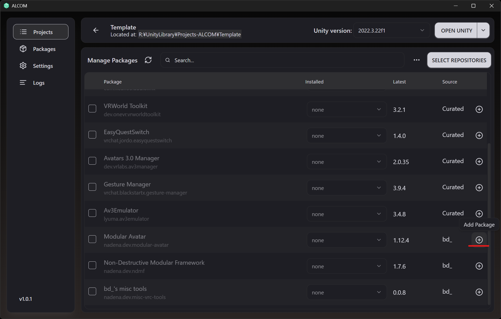
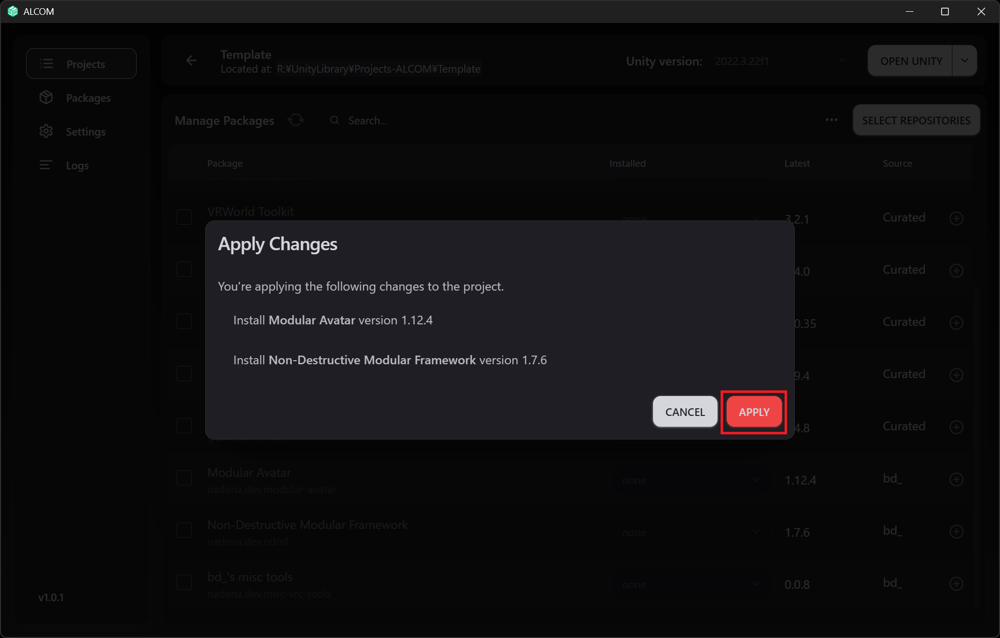
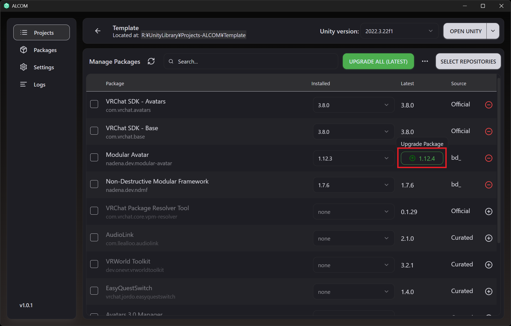

# Modular Avatar

Modular Avatar is a suite of **non-destructive** tools for modularizing your avatars, and for distributing avatar
components.
With Modular Avatar, adding a new outfit or gimmick to your avatar is as easy as drag-and-drop!

Modular Avatar's features are packaged as individual components, which can be added as needed. You can opt-in to just the features
you want to use. It can automatically merge outfits onto your avatar, build an animator out of multiple components, and much more.

## Installation

The recommended way to install Modular Avatar is using the VRChat Creator Companion. After installing the VCC, click here:
* [Add Modular Avatar to VCC](vcc://vpm/addRepo?url=https://vpm.nadena.dev/vpm.json)

Then, go to "manage project" for your project, and click the + next to Modular Avatar.

To update to the latest version, just click the green arrow in the "Latest Version" column.

## Prerelease versions

To make prerelease versions available in the VCC, [click here](vcc://vpm/addRepo?url=https://vpm.nadena.dev/vpm-prerelease.json)

Then, in your VCC Settings -> Packages window, uncheck the `bd_` repository, check the `bd_ prerelease` repository, and enable `Show pre-release packages`.

The documentation for the prerelease branch can be [found here](https://modular-avatar.nadena.dev/dev).

Prerelease versions may contain bugs, and/or may have compatibility breaks as development progresses. Please leave
feedback and bug reports at the [github issues page](https://github.com/bdunderscore/modular-avatar/issues).

## Installation via ALCOM

If you are using [ALCOM](https://vrc-get.anatawa12.com/en/alcom/) to install Modular Avatar, follow these steps:

1. Open "Packages" and select "ADD REPOSITORY".
2. Enter the following values under "Enter informatino about the repository" and click "ADD REPOSITORY":
    - Stable: `https://vpm.nadena.dev/vpm.json`
    - Prerelease: `https://vpm.nadena.dev/vpm-prerelease.json`
3. Confirm the following details are displayed, then click "Add VPM Repository":
    - Repository Name: `bd_` or `bd_ (prereleases)`
    - URL: The URL you entered.

Afterward, open "Manage Project" for your project, click the + next to Modular Avatar, and then click `APPLY`.

To update to the latest version, click the area with the version number and green arrow, then click `APPLY`.

## What to read next

Once you've installed MA, check out one of the tutorials below:
* [Simple clothing setup](/docs/tutorials/clothing)
* [Advanced clothing setup](/docs/tutorials/adv_clothing)
* [Toggle an object](/docs/tutorials/object_toggle/)
* [Edit menus](/docs/tutorials/menu/)