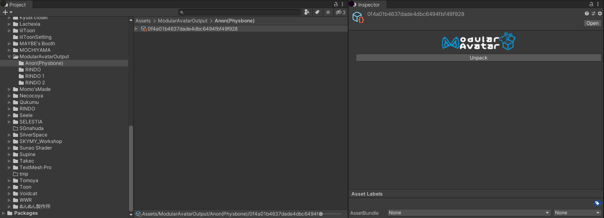

# Manual processing

When developing for VRChat, usually you can just let Modular Avatar automatically process your avatar; when you enter
play mode or build your avatar, Modular Avatar will apply its transformations automatically. However, there are some
cases where you might want to manually apply Modular Avatar processing - for example, when building an avatar for a
non-VRChat platform, or when you are debugging issues with your avatar.

You can trigger manual processing by right-clicking your avatar and selecting `Modular Avatar -> Manual bake avatar`.
Modular Avatar will create a copy of your avatar with all transformations applied.

## Generated Assets

Modular Avatar generates a number of assets based on the components you attach to your avatar. When you manually bake
your avatar, these assets are saved in a folder named `ModularAvatarOutput` under your project's main Assets folder.
Initially, all assets are packed into a single file; this is necessary to avoid Unity bugs and improve processing time.
However, you can unpack this file by selecting it in your project view, then clicking `Unpack` on the inspector pane.

Modular Avatar will then unpack the generated assets into separate files.

Regardless of whether you choose to unpack or not, if you delete the cloned baked avatar, it's safe to delete the
`ModularAvatarOutput` files.