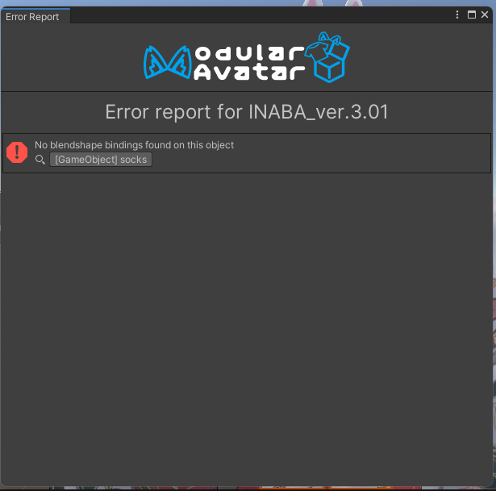
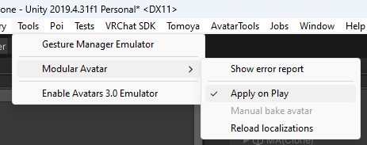

---
sidebar_position: 7
---

# Dealing with problems

When an error occurs during avatar processing, Modular Avatar will open an error report window.

You can click on the object name to select the object in the scene view. Most errors on this report will update automatically
as you edit your avatar, but for some types of errors a new build may be required.

If you close the error report window, you can reopen it from the Unity menubar, under Tools -> Modular Avatar -> Show Error Report.

## Common problems

### Nothing is getting processed at all!

Check that "Apply On Play" is checked:

