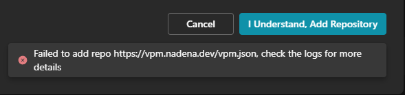

# Installation issues

Here's some common issues you might encounter when trying to install Modular Avatar.

## "Failed to add Repo"

Due to a bug in the VCC, you might sometimes get this error when trying to add the Modular Avatar repository.
Usually this means the repository has already been added. If you can't see the Modular Avatar package in the package
list, the repository might be disabled. Click "Cancel", then look in the "Community Repositories" list for the "bd_"
repository. Make sure the checkbox is checked.

