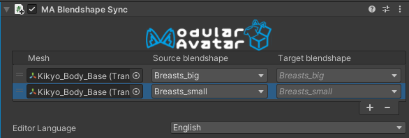
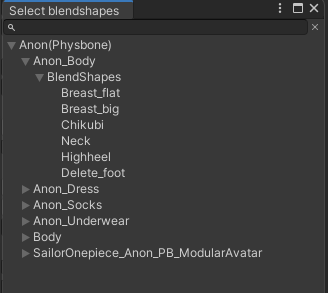

import ReactPlayer from 'react-player'

# Blendshape Sync

The Blendshape Sync component allows you to ensure that a particular blendshape on one renderer always matches that of another.

<ReactPlayer controls muted loop playsinline url='/img/blendshape-sync.mp4' />

## When should I use it?

Often, avatars will have blendshapes to adjust the shape of their body. If you are creating (or using) an outfit for such an avatar, and the outfit has a matching shapekey, Blendshape Sync is the component for you!

This can also be useful in base avatars as well - to sync up blendshapes between different objects.

## When shouldn't I use it?

Blendshape Sync always copies the same value from one renderer's blendshape to another. If the scale or animation curves need to be different, then it will not work properly.

Blendshape Sync cannot be chained - that is, you can copy from A to B and A to C, but you can't copy from A to B and B to C.

At runtime, Blendshape Sync only supports syncing blendshapes that are controlled by animators. Blendshapes controlled by VRChat's builtin eyelook or viseme systems cannot be synced accurately. 

## Setting up Blendshape Sync

Add the Blendshape Sync component to an object in your prefab. Then click the + button to open a selection window.

Double-click on a blendshape to add it to the list to sync. When you've added enough, click the X to close the editor window.

Blendshape Sync supports multi-selection editing as well, so you can select multiple meshes to configure at once.

Note that blendshape sync currently does not support syncing through multiple levels of objects (object A -> object B -> object C).

### What does it do, exactly?

Blendshape Sync does two things:

* In edit mode, it copies the blendshape values from the base automatically, so changes to the base object's shapekeys will take effect in the other objects immediately.
* In play mode, it modifies any animations which animate the base object's blendshapes to also animate the other objects' blendshapes.