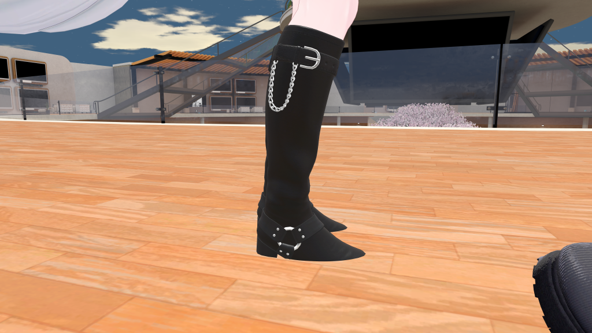

# Floor Adjuster

Floor Adjuster lets you adjust the vertical position of the avatar so that the floor (avatar root position) matches
the bottom of your shoes.

## When should I use this?

If you are attaching shoes to the avatar, sometimes it's necessary to adjust the avatar's position so that the shoes
are not hidden by the floor.

  
  *Before floor adjuster*

  
  *After floor adjuster*

## When shouldn't I use this?

In VRChat, it is not currently possible to adjust the avatar's height dynamically - as such, if you have multiple
outfits
that require different floor heights, it's not currently possible to adjust the avatar's position.

## How can I use this?

Create a new GameObject and add the Floor Adjuster component. Adjust the position of this game object to align
vertically with the bottom of your shoes.

:::tip

It's best to put the scene view into a side-on, isometric view when making this adjustment.

:::

:::warning

In VRChat, it's not possible to adjust the avatar's height dynamically. As such, if multiple Floor Adjusters are
present,
no adjustment will be made. This behavior might change in the future if it becomes possible to dynamically adjust the
avatar's height.

:::

