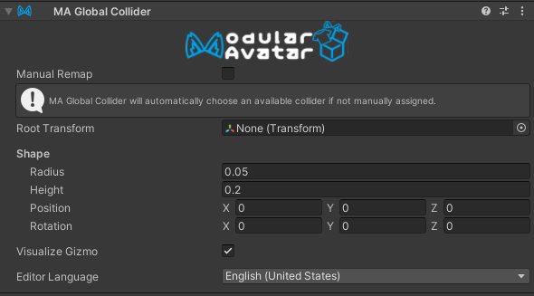

# Global Collider

The `MA Global Collider` component is used to define colliders on your avatar which can globally interact with other dynamic systems.

## When should I use it?

You can place this component on any game object and define its shape like a standard capsule or VRChat Physbone collider.

## What does it do

The functionality of this component varies by platform. Only VRChat is supported Currently.

On VRChat, we hijack and adjust the built in avatar finger bones, so you can run out of global colliders. If a collider is not manually chosen, this component will automatically choose an available finger collider. When using the component manually, it should be noted that not all colliders listed provide collision in VRChat. The Head, Torso, and Feet are only contact senders.

On other platforms, we may implement this in a different way.

## When should I not use it?

When building for VRChat, there's limit of 8 possible global colliders (8 fingers) but it's reccomended to only use 6 to preserve the Index Finger which may be used by world experiences.

## Example Usage

- Adding a collider to a gimmick or prop so it can interact with PhysBones on other avatars.
- Moving the a VRChat Hand collider to change where you grab things from. (Such as to the mouth to mimic biting)
- Adding shockwave/recoil effects to weaponry by animating the GameObject bject with a collider.
- Modularizing a base's collider config with a prefab.