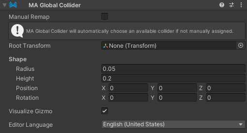

# Global Collider

The `MA Global Collider` component is used to define colliders on your avatar which can globally interact with other dynamic systems.

## When should I use it?

You can place this component on any game object and define its shape like a standard capsule or VRChat Physbone collider.

## What does it do?

The functionality of this component varies by platform.

When building a VRChat avatar, it remaps and adjusts the shapes of colliders from the avatar descriptor to the newly defined bones. If a collider is not manually chosen, this component will automatically choose an available finger collider from the avatar descriptor to remap.

When building for platformName, 

## When should I not use it?

When building for VRChat, there's limit of 8 possible global colliders but it's reccomended to only use 6 to preserve the Index Finger, which may be used by world experiences.

## Example Usage

 - Adding a collider to a gimmick or prop so it can interact with PhysBones from other avatars.
 - Moving the a VRChat "Hand" collider to change where you grab things from. (Such as to the mouth to bite physbones)
 - Modularizing your base's colliders with a prefab.