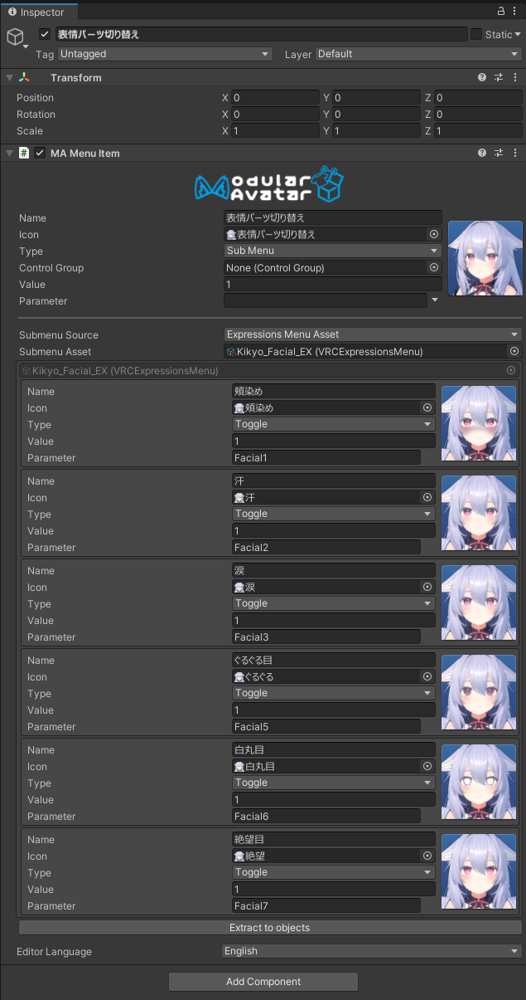
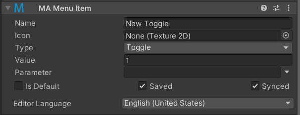

# Menu Item

The Menu Item component allows you to define an expressions menu item from within the Unity hierarchy.

## When should I use it?

This component can provide a more convenient way to edit and define menu items than defining VRC Expressions Menu assets. You can move menu items around by dragging and dropping them through the hierarchy, and it provides an editor interface that is aware of parameter names defined on [MA Parameters](parameters) components.

## How do I use it?

:::tip

A full tutorial on using the menu editor system is available [here](/docs/tutorials/menu).

:::

The menu item component defines a single menu item in a larger menu. You can configure the icon, menu type, and parameter for the menu item. The name of the menu item will be taken from the name of the containing game object. This lets you see the name of, and rename menu items directly from the hierarchy.

### Submenus

When menu items are set as a submenu, you can configure where the submenu is sourced from. You can either set submenu source to "Expressions Menu Asset" and configure a traditional VRC Expressions Menu asset to reference, or you can set the 'submenu source' to Children, in which case Menu Items attached to direct children of this menu item are used to populate the submenu.

If the number of items in the submenu exceeds the maximum number of items on a VRC menu, a "next" item will automatically be created to split up the menu.

When submenu source is children, you can also specify a "source object override". If set, the children of that object will be used, instead of the direct children of the menu item.

### Binding submenus

In order to define where a menu item will go in the menu, another component will be needed to _bind_ it to a menu. There are three ways of doing this:

* The menu item can be set as the child of another menu item set in submenu / children mode.
* The menu item can be on the same game object as a [Menu Installer](menu-installer) component.
* The menu item can be the child of a [Menu Group](menu-group) object (which would typically be on a game object with a Menu Installer component)

Unbound menu items have no effect.

### Automatic Parameter Creation

When you specify a parameter name that is not declared in a [MA Parameters](parameters.md) component or VRC Expressions
Parameter asset, the Menu Item will create a parameter for you automatically. When this happens, you'll see some
checkboxes
to control whether the value is saved/synced.

If you click "Is Default", this menu item will be set as the default for this parameter. If multiple menu items are set
to "Is Default", the results are undefined. Don't do that!

If your menu item has no parameter name set, you'll still see these options; a parameter will be created if you have
any [Reactive Objects](./reaction/index.md) controlled by this menu item.