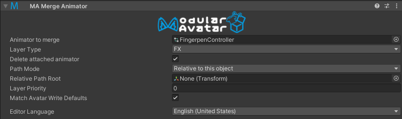
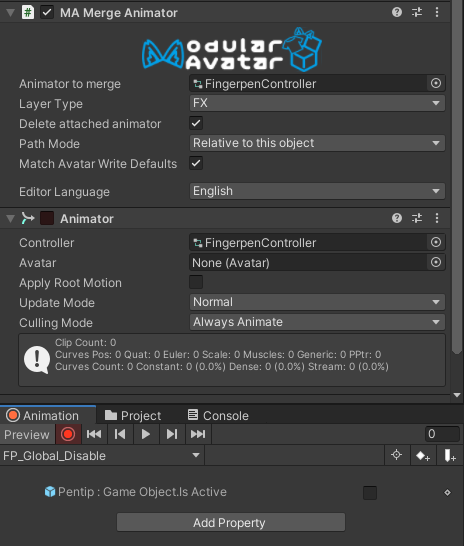

# Merge Animator

The merge animator component will add the provided animator to a specified layer of the avatar it is added to. This can be used to make complex AV3 gimmicks that install themselves just by dragging and dropping onto an avatar.

[Two samples](/docs/samples/) are included that use this component: A hand-clap effect, and a finger-pen gimmick.

## When should I use it?

Merge Animator should be used when you have animations you'd like to play back as part of your gimmick.

## When shouldn't I use it?

Merge Animator adds to, but does not replace existing animator layers. If you want the end-user to completely replace an animator layer, it may be better to have them replace it in the avatar descriptor in the traditional way.

## Setting up Merge Animator

Add the Merge Animator component to an object in your prefab, and attach the animator in the "Animator to merge" field. Set the "Layer Type" field to the avatar layer this should be added to (e.g. FX).

### Recording animations

By default, paths in your animator are interpreted as relative to the merge animator component. This makes it easy to record new animations, provided you're animating object underneath the Merge Animator component.

Just attach an Animator component to your GameObject, and you can use the Animation panel to record animations:

As a development convenience, you can check the "Delete attached animator" box to remove the animator component at build time.

### Humanoid bone animations

Animations that move humanoid bones ignore the relative path logic, and will always apply to the overall avatar. As such most humanoid animations (e.g. AFK animations) can be used as-is.

### Path mode

The path mode option controls how animation paths are interpreted. In "Relative" mode, all paths are relative to a
specific object, usually the one the Merge Animator component is attached to. This allows you to create gimmicks that
work when they're moved around in the avatar,
and makes it easier to record the animations, by using the Unity animator component (as described above). You can
control which object is used as the root for paths in animations by setting the "Relative Path Root" field.

If you want to animate objects that are already attached to the avatar (that aren't under your object), set the path mode to "Absolute". This will cause the animator to use absolute paths, and will not attempt to interpret paths relative to the Merge Animator component.
This means you will need to record your animations using the avatar's root animator instead.

### Layer Priority

Layer priority controls the order in which Merge Animators are applied. They will be placed in the final animator in
increasing order of priority (that is, lower numbers are first in animator order, and higher numbers override them).
Merge Animators with the same priority will be placed in the order they are in the hierarchy. Any pre-existing animator
is considered to be at priority zero, before all priority-zero Merge Animators.

### Merge Mode

By default, Merge Animator will add the animator to the specified layer. If you want to replace the layer instead, set
the merge mode to "Replace Existing Animator". This will replace any animator configured on the VRChat Avatar Descriptor
with the one you provide.

The replaced animator will keep the priority you specified, but it will be applied before any other Merge Animators
at that priority level.

Having multiple Merge Animators set to the same Layer Type and Replace mode will result in an error.

### Write Defaults

When the "Match Avatar Write Defaults" checkbox is checked, Merge Animator will ensure that the write defaults state of your animator states matches the avatar's animator.
This will detect whether the avatar is using write defaults ON or OFF states consistently, and if so your animator will be adjusted to match. If the avatar is inconsistent in its use of write defaults, your animator will be unchanged.

Note that certain uses of blend trees are excluded from this conversion, as some types of blend trees do not support a write defaults "off" setting.

## Limitations

### VRCAnimatorLayerControl

Currently, Merge Animator only supports VRCAnimatorLayerControl state behaviors which reference layers within the same animator.
If you intend to use this support, ensure the `Playable` field matches the layer set on the Merge Animator component, and set the `Layer`
field to be the index of the layer within your animator.