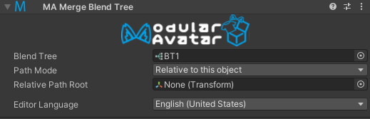

# Merge Motion (Blend Tree)

The merge motion component allows you to merge multiple blend trees into a single FX layer.
This is an advanced component that allows for building lower-overhead animators by merging multiple gimmicks into a
single layer.
It can also be used to set an animation that is always running.

:::info

Prior to 1.12, this component was called "Merge Blend Tree". In 1.12 it was expanded to support merging animation clips
as well; as such the name was changed to "Merge Motion". Existing assets created using 1.11 or earlier's Merge Blend Tree
will automatically be upgraded to use the new Merge Motion component.

For API compatibility purposes, this component is still internally called `ModularAvatarMergeBlendTree`.

:::

## When should I use it?

You should use Merge Motion when you have a motion (animation clip or blend tree) that you want to be always active 
n the avatar.

## When shouldn't I use it?

You should not use Merge Motion if you need to disable/enable the Motion, or have control over motion time.

## Merging a Blend Tree

First, create a Blend Tree asset. You can do this by right clicking on the project window and selecting
Create -> BlendTree.

Configure your blend tree as desired, then add a Merge Motion component and specify the Blend Tree in the Motion
field.

You can configure Path Mode and Relative Path Root similarly to Merge Animator; for more details, see the
[Merge Animator documentation](merge-animator.md).

## Merging animations

Simply put the animation in the "Motion (or Blend Tree) to merge" field. The animation will be constantly played.

## How motions are merged

Modular Avatar will create a new layer at the top of the FX controller. This layer will contain a single state, with
Write Defaults on, and containing a Direct Blend Tree. Each merged motion will be attached to this Direct Blend
Tree, with its parameter always set to one.