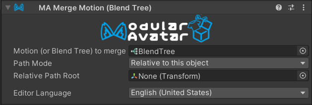

# Merge Blend Tree

The merge blend tree component allows you to merge multiple blend trees into a single FX layer.
This is an advanced component that allows for building lower-overhead animators by merging multiple gimmicks into a
single layer.

## When should I use it?

You should use Merge Blend Tree when you have a blend tree that you want to be always active on the avatar.

## When shouldn't I use it?

You should not use Merge Blend Tree if you need to disable/enable the blend tree, or have control over motion time.

## Setting up Merge Blend Tree

First, create a Blend Tree asset. You can do this by right clicking on the project window and selecting
Create -> BlendTree.

Configure your blend tree as desired, then add a Merge Blend Tree component and specify the Blend Tree in the Blend
Tree field.

You can configure Path Mode and Relative Path Root similarly to Merge Animator; for more details, see the
[Merge Animator documentation](merge-animator.md).

## How blend trees are merged

Modular Avatar will create a new layer at the top of the FX controller. This layer will contain a single state, with
Write Defaults on, and containing a Direct Blend Tree. Each merged blend tree will be attached to this Direct Blend
Tree, with its parameter always set to one.