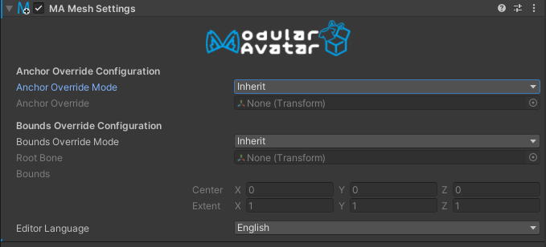

# Mesh Settings

The Mesh Settings component lets you set certain mesh settings (anchor override and bounds) for all meshes
under a particular game object.

## When should I use it?

You can place this component at the top level of your avatar to ensure that bounds and light probe anchors
are consistent for all meshes in your avatar.

The "Setup Outfit" feature will also automatically configure a Mesh Settings component on newly added outfits.

Finally, Mesh Settings can be used to _exclude_ meshes from the influence of Mesh Settings higher up on the
hierarchy.

## When shouldn't I use it?

Setting bounds or light probes on assets for distribution requires some care, as these configurations
might be inconsistent with the avatar they are applied to. Generally, these should only be set on assets
designed for a specific avatar.

## Manually configuring Mesh Settings

When you add Mesh Settings to a game object, initially it is configured to do nothing. In order for the settings
component to have any effect, you need to change the "Anchor Override Mode" and/or "Bounds Override Mode". These
support the following options:

- Inherit: This component does nothing for this setting; it will inherit values set in parent Mesh Settings.
- Set: This component sets the corresponding setting on any meshes on its GameObject or its children.
- Don't set: This component _blocks_ any parent Mesh Settings from having an effect. Meshes will remain at their default
  settings.
- Set or inherit: If there is a parent Mesh Settings in Set mode, it will be used. If no parent Mesh Settings applies,
  then this component's settings will be used. This is useful for outfit prefabs, to ensure that any avatar-wide
  settings
  take precedence.

When configuring bounds, the bounding box will be determined relative to the transform you specify as the
"Root Bone". Note that bounds only affects Skinned Mesh Renderers, but Anchor Override also impacts other
types of renderers like Mesh Renderers or Line Renderers.
