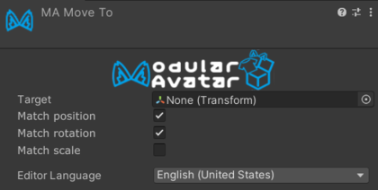

# Move To

Move To makes an object match the transform of another object in the avatar. It is useful when an object should
be moved to a target's position initially, but should not continue tracking that object at runtime.

## Setting up Move To

Add the Move To component to the object you want to move, then set **Target** to an object in the avatar. Select which
transform properties should be copied:

- **Match position** aligns the object's world position with the target.
- **Match rotation** aligns the object's world rotation with the target.
- **Match scale** adjusts the object's scale to match the target, including when their parents have different scales.

Move To updates the object continuously while editing. During the avatar build, it applies the selected transform
properties once, after Bone Proxy processing, then removes itself from the built avatar.
