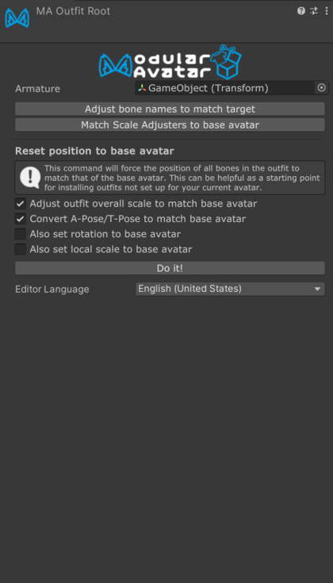

# Outfit Root

The Outfit Root component identifies the root GameObject of an outfit.

## What is Outfit Root?

[Setup Outfit](/docs/tutorials/clothing/) automatically adds Outfit Root to the selected outfit object and assigns its
Armature Root. You normally do not need to add or configure this component manually.

:::note

If you run Setup Outfit on an outfit that was set up using a prior version of Modular Avatar, it'll also add an Outfit
Root component for you.

:::

If you add Outfit Root manually, set **Armature Root** to the root Transform of the outfit's main bone hierarchy.

Outfit Root doesn't do anything directly itself; it's intended to provide convenient access to otherwise-buried options,
and to provide a marker for other tools to work with.

## Outfit adjustment tools

The Outfit Root inspector provides convenient access to options to adjust the outfit fit:

- **Adjust bone names to match target** attempts to rename the outfit's bones to match the base avatar.
- **Reset position to base avatar** moves corresponding outfit bones to the base avatar's bone positions for every Merge
  Armature under the Armature Root. Its options can also convert between A-pose and T-pose, adjust the outfit's overall
  scale, and copy bone rotations or local scales.
- **Match Scale Adjusters to base avatar** adds, updates, or removes [Scale Adjuster](scale-adjuster.md) components on
  matching outfit bones to mirror the base avatar.
