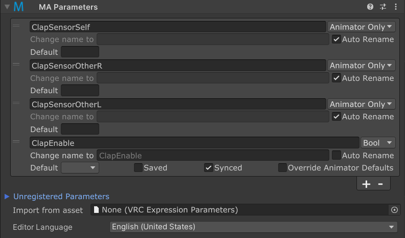

# Parameters

The Modular Avatar Parameters component allows you to define the animator parameters your gimmick uses either internally,
or to communicate with other components. It renames parameters to avoid conflicts, and defines synced and unsynced
animator parameters and their defaults

## When should I use it?

The Parameters component should be used when you're building a gimmick which makes use of animator parameters other
than VRChat builtins.

## How do I use it?

### Setting defaults

The parameters UI shows each parameter initially in a collapsed view. This view makes it easy to set the default values
for each parameter, and whether they are saved when you change avatars, or change worlds. Setting a non-blank default
value will override the value in the main Expressions Parameters asset, if any.

You can set a blank value here as well; this can be useful if multiple MA Parameters components define the same
parameter, where the "default value" field will ignore any MA Parameters component which does not set a default.
Setting default values for the same parameter in multiple Parameters components will result in a warning, as it's
unclear which should be used.

For the "Saved" option, generally speaking the parameter will be saved if any MA Parameters component sets it to be
saved. However, there is an exception; see the section on "Nesting" for more information. Note also that the "Saved"
setting in MA Parameters will override any setting in the Expressions Parameters asset, if any.

### Renaming parameters

By setting the "Change name to" field you can _rename_ a parameter. That is, if you have a parameter "foo", which has
a "Change name to" setting of "bar", then on the object with the MA Parameters component and its children you can
refer to this parameter as "foo" (eg in [MA Menu Item](menu-item.md), [MA Merge Animator](merge-animator.md), or in
VRChat Contact Receivers); however, outside of this object, the parameter will be referred to as "bar".

By renaming parameters on multiple components to use the same name, you can wire up one gimmick to trigger another.
You can also select "Auto Rename" to have Modular Avatar automatically select an unused name; this will help avoid
accidental name collisions between different gimmicks.

### Creating new parameters

You can define a new parameter in two different ways. First, you can click the "+" button at the bottom of the list of
parameters; then click the chevron next to the parameter to set its name.

Second, you can expand the "Unregistered Parameters" section; this section lists parameters which have been
detected in components inside this GameObject and its children. You can click the "Add" button to add the parameter,
or the magnifying glass to see where the parameter was detected.

Either way, after creating the parameter, click the chevron next to the new parameter to expand the detailed view.
There, you can set the parameter type (which controls whether the parameter is synced), and other attributes of the
parameter.

### PhysBones and Contacts

MA Parameters can rename parameters used by VRChat PhysBone components and Contact Receivers. For PhysBones, enter the
prefix (the value in the "Parameter" field of the VRC Phys Bone component) as the parameter name, and click the
"Is PhysBone Prefix" option. This will be automatically set if you add it via the "Unregistered Parameters" section.

### Expression Parameters

Set the "Parameter type" field to register the parameter in the VRC Expressions Parameters list. This will sync the
parameter over the network, and allow for it to be used in the expressions menu and in OSC. If you don't need the
parameter to be synced, click "Local Only". 

### Nesting

MA Parameters components can be nested. This lets you build up a complex system out of multiple subcomponents. Each
MA Parameters component can apply renamings to all of its children. This means that if you have an inner MA Parameters
which renames "foo" to "bar", and an outer MA Parameters which sets "bar" to "auto rename", you can still access "bar"
in the objects in-between.

There are a few notable subtleties when nesting components:

* The "Saved" parameter will take the outermost "Saved" setting. However, when multiple MA Parameters components which
  are not nested set "Saved" to different values, the parameter will be saved if any of the components set it to be
  saved.
* The "Default Value" field will take the outermost setting; however, if outer components have a blank default value,
  the innermost non-blank default value will be used. If multiple components which are not nested set a non-blank
  default value, a warning will be shown, as it's unclear which should be used.