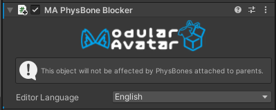

# PhysBone Blocker

The PhysBone Blocker prevents physbones rooted in parent objects from affecting a child object.
It does this by adding this child object to the Ignore list for any PhysBone affecting a parent object.

## When should I use it?

When making accessories that someone might want to attach to a PhysBone chain like a tail or an ear,
you can attach a PhysBone Blocker to prevent the parent PhysBone chain from affecting the child object.

Note that you can still attach a PhysBone component to the child object that has the PhysBone Blocker on it.

## Use with Bone Proxies

When using the [Bone Proxy component](bone-proxy.md) to attach an object to a pre-existing PhysBone chain,
attaching the PhysBone blocker will ensure that your object is rigidly attached to the parent chain.
When doing this, it's best to have the PhysBone Blocker on the same object that has the Bone Proxy.