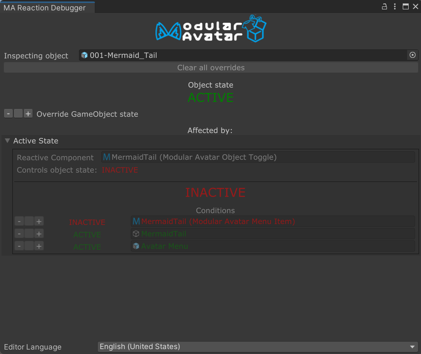
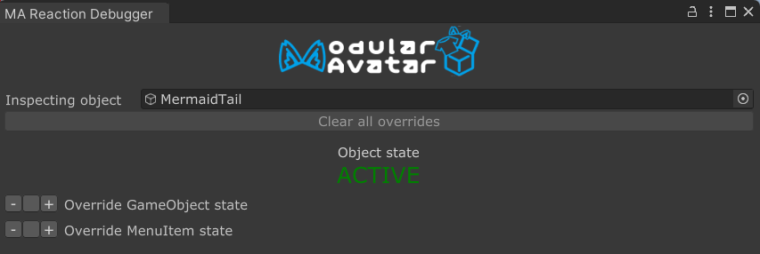
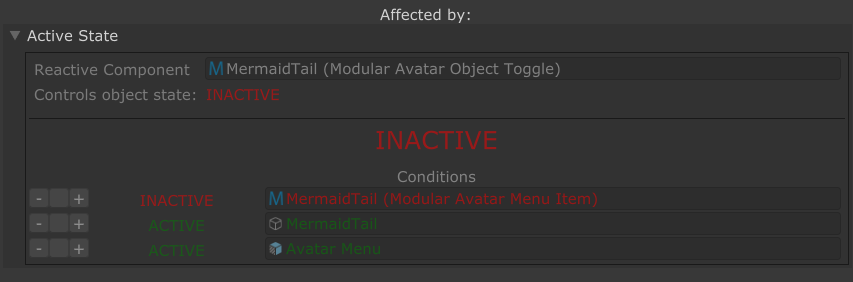

---
sidebar_position: 900
---

# Reaction Debugger

The Reactive Component Debugger allows you to virtually change the state of menu items and game objects in your scene,
so you can test how your reactive components will behave without needing to manually interact with your avatar.

To open the Reactive Component Debugger,  right click a Game Object and choose `Modular Avatar -> Show Reaction Debugger`.
Alternatively, you can click the `Open reaction debugger` button on a reactive component.

The debugger window is divided into two sections: One showing the state of the object itself, and one for the reactions
that affect it.

## Object state section

The top section lets you select which object you want to examine, by changing the `Inspecting object` field. By default,
it will show you the currently selected object, but if you change the field you can examine some other object instead.
As with inspector windows, you can lock the view to avoid it changing when you select different objects in the scene.

Below the `Inspecting object` field, there is a button to clear all active overrides. More on that later. We also see an
`Object state: ACTIVE` here, showing that this object is (virtually) active.

Below that are two options to force the object to be active/inactive, and to force the associated menu item to be selected
or deselected. Click the `-` or `+` buttons to trigger such a forced state, or the middle (blank) button to clear the
override.

Forcing an object to be "active" or "inactive" doesn't actually change its state in the hierarchy, but it'll be shown as
if it was enabled or disabled in the scene view window.

## Reaction section

The reaction section shows all "incoming" reactions that affect this object. It also shows what conditions need to be
true for the reaction to be triggered, and lets you easily override those conditions.