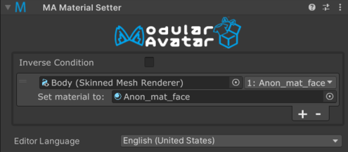

# Material Setter

The Material Setter component allows you to change the materials of a renderer on yout avatar, when the Material Setter
component's GameObject is enabled.

Material Setter is a type of [Reactive Component](./index.md). See that page for general rules and behavior of reactive
components.

## When should I use it?

Material setter can be used to change out the material of an object, either directly in response to a menu item, or in
response to some other object appearing or disappearing.

## Setting up Material Setter

Attach the Material Setter component to the GameObject that will control its state. This can either be an object that
will be animated to enable/disable it, or it can be on a Menu Item (or a child thereof). You can also attach it to an
object that is always enabled, to change the material of an object at all times.

Next, click the + button to add a new entry. Drag the renderer you want to manipulate onto the top object field, and
select the material slot you want to change on the right side dropdown box. Then, put the material you want to insert
into the "Set material to" field.

By default, Material Setter will change the material when the GameObject is enabled (and/or the associated menu item is
selected). If you want to change the material when the GameObject is disabled, you can select "Inverse condition".