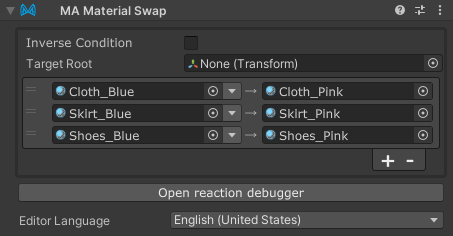

# Material Swap

The Material Swap component allows you to swap materials on your avatar with other materials in bulk,
when the Material Swap component's GameObject is enabled.

Material Swap is a type of [Reactive Component](./index.md). See that page for general rules and behavior of reactive
components.

## When should I use it?

Material Swap can be used to swap materials on your avatar in bulk, either directly in response to a menu item, or in
response to some other object appearing or disappearing.

In Material Setter, you specify the renderers whose materials will be changed, whereas in Material Swap, you specify the materials to be swapped.

## Setting up Material Swap

Attach the Material Swap component to the GameObject that will control its state. This can either be an object that
will be animated to enable/disable it, or it can be on a Menu Item (or a child thereof). You can also attach it to an
object that is always enabled, to swap materials on your avatar at all times.

Next, click the + button to add a new entry.
Drag the material you want to swap from onto the left material field,
and drag the material you want to swap to onto the right material field.

To limit the scope to a specific hierarchy, you can set "Target Root".

By default, Material Swap will swap materials when the GameObject is enabled (and/or the associated menu item is
selected). If you want to swap materials when the GameObject is disabled, you can select "Inverse condition".

## Quick Swap

Material Swap also supports a "Quick Swap" mode, which allows you to quickly cycle through different materials, previewing
how they look on your avatar. Depending on how your materials are placed in your project, there are several different modes
you can use:

- **None**: Disables Quick Swap mode.
- **Same Folder**: Looks for materials in the same folder as the current post-swap material.
- **Adjacent Folders**: Looks for materials with a similar name in adjacent folder. For example, if the current
  material is `Assets\SomeOutfit\Materials\Blue\Outer.mat`, it might look for things like `Assets\SomeOutfit\Materials\Red\Outer.mat`.
  This mode is useful if there are multiple materials for different components of the same outfit, organized into
  adjacent folders for different colors or styles.

If you're not sure which mode to use, you can try both and see which one works best for your outfit.

When Quick Swap is enabled, you'll see two arrows in the Material Swap component's inspector, next to the target material.
You can click these arrows to quickly swap to the next or previous material in the list.