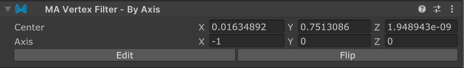

# Vertex Filter - By Axis

`Vertex Filter - By Axis` is a Vertex Filter component which, in combination with [Mesh Cutter](./), allows you to
select portions of a mesh to delete or hide, based on whether they are on one side of a plane.

## When should I use it?

One common use case for `Vertex Filter - By Axis` is to allow you to select one side of a mesh, in cases where
the same UV coordinates are used for both sides. For example, if you have a ribbon mesh that uses the same texture
coordinates for both left and right sides, you can use a `By Mask` filter to select the ribbon as a whole, then
use a `By Axis` filter to restrict it to only one side.

## When shouldn't I use it?

When creating assets for distribution, some care is needed when using `Vertex Filter - By Axis`. Because the shape of
the avatar, and therefore the portion of the mesh selected, might change if the end-user uses a `Scale Adjuster`,
it's recommended only to use `By Axis` filters for rough selections - such as selecting only the left or right side of
the model - and to use other filters such as [`By Mask`](by-mask.md) for precise selections.

## Setting up Vertex Filter - By Axis

`Vertex Filter - By Axis` must be attached to a GameObject with a [Mesh Cutter](./) component. You can add it by
clicking
the "Add Vertex Filter" button on the Mesh Cutter component, or by adding a `Vertex Filter - By Axis` component
manually.

Once you do, click the `Edit` button to show a gizmo that can be used to adjust the position and orientation of the
`By Axis` plane. The plane is infinite, and divides space into two halves - vertices on one side of the plane will be
selected, while vertices on the other side will not. The white arrow gizmo indicates the side of the plane that will be
erased.

The `Center` and `Axis` fields are interpreted in the local space of the renderer.