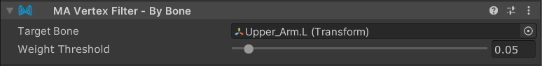

# Vertex Filter - By Bone

`Vertex Filter - By Bone` is a Vertex Filter component which, in combination with [Mesh Cutter](./), allows you to
select portions of a mesh to delete or hide, based on their bone weights to a specific bone.

## Setting up Vertex Filter - By Bone

`Vertex Filter - By Bone` must be attached to a GameObject with a [Mesh Cutter](./) component. You can add it by clicking the "Add Vertex Filter" button on the Mesh Cutter component, or by adding a `Vertex Filter - By Bone` component manually.

### Configuration

- **Target Bone**: Select the bone transform you want to filter by. Only vertices weighted to this bone will be considered.
- **Weight Threshold**: Set the minimum bone weight required for a vertex to be selected (0.0 to 1.0). Vertices with bone weights equal to or above this threshold for the target bone will be filtered.
    - Bone weights are normalized before being compared to the threshold.

### How it works

The filter examines each vertex's bone weights and selects vertices that have a weight to the specified bone that meets or exceeds the threshold. This allows for fine control over which parts of a mesh are affected based on their skeletal binding.

For example:
- Setting threshold to 0.01 will select vertices with any meaningful weight to the bone
- Setting threshold to 0.5 will only select vertices that are primarily controlled by the bone
- Setting threshold to 1.0 will only select vertices completely controlled by the bone

Note: This filter only works with Skinned Mesh Renderers that have bone weight data. It has no effect on regular Mesh Renderers or meshes without bone weights.