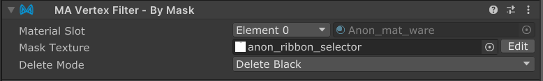

# Vertex Filter - By Mask

`Vertex Filter - By Mask` is a Vertex Filter component which, in combination with [Mesh Cutter](./), allows you to
select portions of a mesh to delete or hide, based on a mask texture.

## Setting up Vertex Filter - By Mask

`Vertex Filter - By Mask` must be attached to a GameObject with a [Mesh Cutter](./) component. You can add it by
clicking
the "Add Vertex Filter" button on the Mesh Cutter component, or by adding a `Vertex Filter - By Mask` component
manually.

Once you've added the component, ensure that the Target Renderer field on the Mesh Cutter component is set to the object
you want
to modify. Then, select the `Material Slot` you want to delete polygons from.

:::note

A single Vertex Filter - By Mask component can only select polygons from a single material slot. If you want to delete
polygons from multiple material slots, you can create multiple Game Objects, each with their own Mesh Cutter and Vertex
Filter.

:::

Once you've selected the material slot, you can set the `Mask` texture. You can either place a premade texture here, or
if you have the [Mask Texture Editor](https://github.com/nekobako/MaskTextureEditor) extension installed, click the
`Edit` button to create or edit a mask texture directly in the Unity editor.

Finally, the `Delete Mode` field can be used to select between deleting white or black areas in the mask.