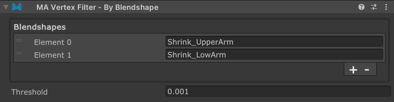

# Vertex Filter - By Blendshape

`Vertex Filter - By Blendshape` is a Vertex Filter component which, in combination with [Mesh Cutter](./), allows you to
select portions of a mesh to delete or hide, based on whether vertices move when a specific blendshape is activated.

## When should I use it?

`Vertex Filter - By Blendshape` is useful when you want to remove parts of a mesh that would clip through clothing or accessories when certain blendshapes are active. Common use cases include:

- Removing parts of a body mesh that would show through clothing when facial expressions change the face shape
- Hiding portions of hair that would clip through hats when head blendshapes are activated
- Deleting parts of accessories that would interfere with blendshape-based animations

## Setting up Vertex Filter - By Blendshape

`Vertex Filter - By Blendshape` must be attached to a GameObject with a [Mesh Cutter](./) component. You can add it by
clicking the "Add Vertex Filter" button on the Mesh Cutter component, or by adding a `Vertex Filter - By Blendshape` component manually.

Once you've added the component, ensure that the Target Renderer field on the Mesh Cutter component is set to the object you want to modify.

Next, set the `Shape Name` field to the name of the blendshape you want to use for filtering. You can type the name manually, or click the `Browse...` button to select from available blendshapes on the target mesh.

Finally, adjust the `Threshold` value to control sensitivity. Vertices that move more than this distance (in local space) when the blendshape is fully activated will be filtered out. The default value of 0.001 works well for most cases, but you may need to adjust it depending on your specific mesh and blendshape.

:::tip

Use a smaller threshold value to be more selective about which vertices are filtered, or a larger value to filter more aggressively.

:::