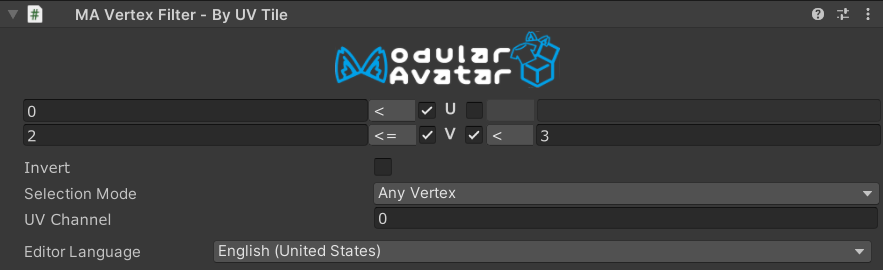

# Vertex Filter - By UV Tile



`Vertex Filter - By UV Tile` is a Vertex Filter component which, in combination with [Mesh Cutter](./), allows you to
select portions of a mesh to delete or hide, based on whether their UV coordinates fall within a specified rectangular
region.

## When should I use it?

`Vertex Filter - By UV Tile` is useful when you want to select specific regions of a mesh based on texture space
coordinates. Common use cases include:

- Selecting individual tiles on a UV tile / UDIM texture layout
- Removing portions of a mesh that occupy a specific area of the UV map
- Selecting visible areas of a mesh when combined with other vertex filters in intersect mode

## When shouldn't I use it?

If your UV coordinates repeat (for example, mirrored UVs on the left and right side of a mesh), a `By UV Tile` filter
will select both the left and right regions simultaneously. In this case, consider using [`By Axis`](by-axis.md) to
distinguish between the two sides.

## Setting up Vertex Filter - By UV Tile

`Vertex Filter - By UV Tile` must be attached to a GameObject with a [Mesh Cutter](./) component. You can add it by
clicking the "Add Vertex Filter" button on the Mesh Cutter component, or by adding a `Vertex Filter - By UV Tile`
component manually.

### Configuration

For each UV coordinate (U and V), you can set lower and upper bounds to define the rectangular selection region. Each
bound has three controls:

- **Enable toggle** — enables or disables the bound. Disabled bounds are ignored, letting you filter on only U, only V,
  or both axes.
- **Operator** — selects whether the bound is strict (`<`) or inclusive (`<=`). A strict bound excludes vertices
  exactly on the boundary value; an inclusive bound includes them.
- **Value** — the coordinate value of the bound.

The left bound acts as a minimum (vertices with U below this value are excluded), and the right bound acts as a maximum
(vertices with U above this value are excluded).

| Field | Description |
|---|---|
| **UV Channel** | The UV set to use (0–7). Defaults to channel 0 (the first UV set). |
| **Selection Mode** | Controls how vertex selection translates to primitive (triangle) selection. See below. |
| **Invert** | When checked, selects vertices _outside_ the specified rectangle instead of inside. |

### Selection Modes

The `Selection Mode` field controls how the filter decides whether a triangle (or other primitive) is selected:

- **Any Vertex** — the primitive is selected if at least one of its vertices falls within the defined UV rectangle.
- **All Vertices** — the primitive is selected only if all of its vertices fall within the rectangle.
- **Centroid** — the primitive is selected based on the UV coordinate at its center. This is the most predictable mode
  for UV-based filtering and works well for tile-based selections.

### How it works

The filter examines the UV coordinates of each vertex (or centroid, depending on the selection mode). When all bounds
are enabled, a vertex is inside the rectangle if:

```
UMin < U < UMax  and  VMin < V < VMax       (all operators set to strict `<`)
UMin ≤ U ≤ UMax  and  VMin ≤ V ≤ VMax       (all operators set to inclusive `≤`)
```

The same formula applies when mixing strict and inclusive bounds — the inequality at each bound is determined by its
individual operator.

When you check **Invert**, the selection is flipped: vertices _outside_ the rectangle are selected instead.

### UV Channel support

If your mesh has multiple UV channels, you can use the **UV Channel** field to select which UV set the filter operates
on. The default channel 0 corresponds to the main texture coordinates.