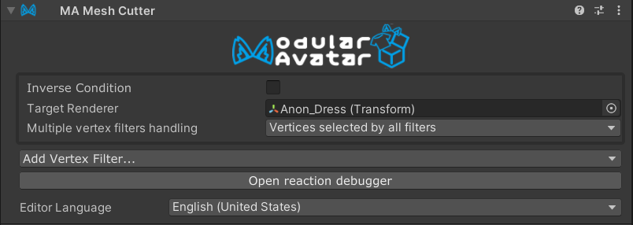
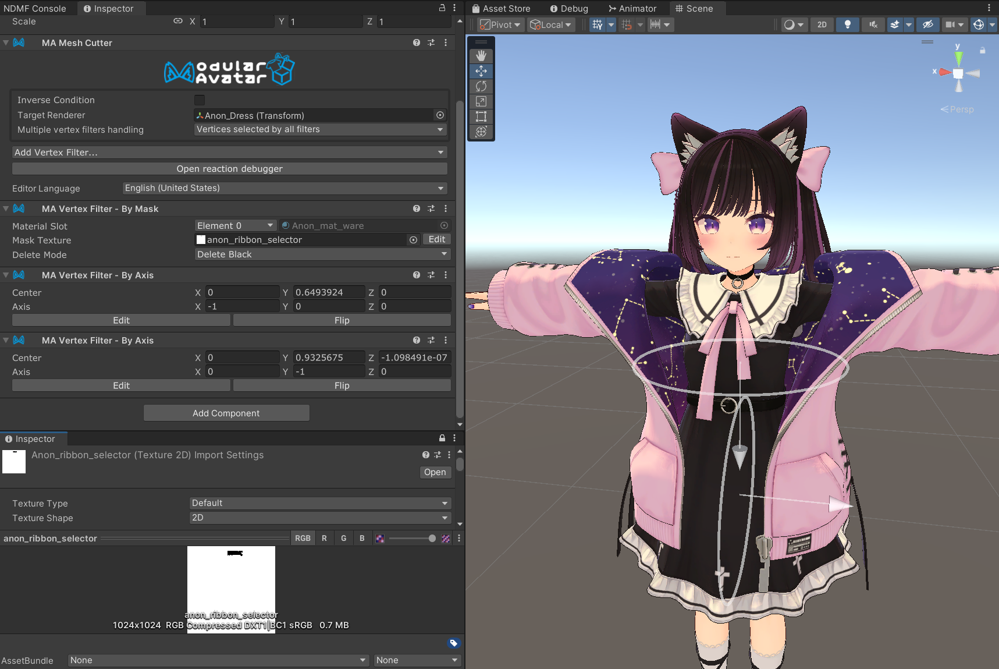

# Mesh Cutter

Mesh Cutter is a component which allows you to delete or hide parts of a mesh, specified by one or more vertex filters.
Mesh Cutter is a type of [Reactive Component](../). See that page for general rules and behavior of reactive components.

## When should I use it?

Mesh Cutter has a number of use cases, including:

- Removing portions of an underlying body mesh that clips through outer layers of clothing
- Deleting portions of a mesh for aesthetic purposes (for example, shortening one side of a ribbon)
- Deleting unnecessary parts of a mesh to reduce polygon count

## When shouldn't I use it?

If you are turning off a mesh because it is fully covered by another mesh, consider
using [Object Toggle](../object-toggle.md) instead.
This is more efficient, as Mesh Cutter still has to process the entire mesh, even if it is entirely hidden.

## Setting up Mesh Cutter

To set up Mesh Cutter, you need to add both Mesh Cutter, and at least one Vertex Filter component.
First, add a Mesh Cutter component, and set the object you want to modify as the `Object` field.
Mesh Cutter will delete or hide vertices on this object, when active (per the rules for reactive components) - if you
want
it to delete when inactive, you can check the `Invert` box.

Next, add one or more Vertex Filter components to the same object. You can do this by clicking the "Add Vertex Filter"
button on the Mesh Cutter component, or by adding a Vertex Filter component manually.

### Supported Vertex Filters

- [By Mask](./by-mask.md) - Allows you to select portions of the mesh by using a mask texture.
- [By Axis](./by-axis.md) - Allows you to select portions of the mesh by whether they are on one side of a plane.  
- [By Bone](./by-bone.md) - Allows you to select portions of the mesh based on their bone weights to a specific bone.
- [By Blendshape](./by-shape.md) - Allows you to select portions of the mesh based on whether vertices move when a specific blendshape is activated.

## Using multiple Vertex Filters

If you add multiple vertex filters, only vertices which match *all* filters will be deleted or hidden. This allows you
to create complex selections that can't be done with a single filter. For example, if a mesh reuses the same UV
coordinates
for its left and right sides, you can use a `By Mask` filter to select a portion of the mesh, then use `By Axis` to
restrict it to only one side.

Here's an example of using multiple filters to shorten one side of a ribbon mesh:

Anon's ribbon uses the same texture coordinates for both left and right sides, so we can't use a single `By Mask` filter
to
select just the left side. Instead, we use a `By Mask` filter to select the ribbon as a whole, one `By Axis` filter to
select
the left side, and another `By Axis` filter to select how far we want to shorten the ribbon.

## Efficiency notes

If the Mesh Cutter is always active, then Modular Avatar will delete the selected polygons entirely. This can be used
to reduce polygon count in order to stay under performance rank limits.

If the Mesh Cutter is sometimes inactive, then Modular Avatar will hide the selected polygons instead. In some cases,
this can require generating constraints, which can contribute to an increase in performance rank.