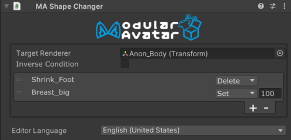

# Shape Changer

The Shape Changer component modifies the shape keys (blendshapes) of another renderer on the avatar, when the Shape 
Changer component is enabled.

Shape Changer is a type of [Reactive Component](./index.md). See that page for general rules and behavior of reactive
components.

## When should I use it?

This component is intended to be used on outfit meshes, in order to delete or shrink parts of the avatar base model
which are hidden by or interfere with the outfit mesh.

## When shouldn't I use it?

This component should not be used to modify blendshapes that are also animated by other animations. Animate the on/off
state of the object containing the Shape Changer component instead.

## Setting up Shape Changer

Attach the Shape Changer component to an object in your outfit. Usually, this will be a skinned mesh renderer. Place the
renderer you want to adjust (i.e. the base avatar body mesh) into the `Target Renderer` field.

Next, click the `+` icon to bring up a blendshape selection window. Clicking on the blendshape names will add them to the
shape changer. The effect of the shape changer will be shown in the scene view in real time. Since the parts you select
will likely be hidden underneath your clothing mesh, it can be helpful to use the 'overdraw' debug overlay in the scene
view to see through the clothing and observe what's happening underneath.

### Shapechange modes

Each blendshape can be set to either 'Delete' or 'Set' mode. In 'Set' mode, the blendshape will be set to the value
indicated when the Shape Changer is active. In 'Delete' mode, Shape Changer will delete the polygons affected by this
blendshape. If not animated, this will reduce the polygon count of the avatar, which can provide a performance benefit.
If animated, it will still fully hide the polygons, but will not reduce the measured polygon count.

In general, Delete should be used when the blendshape would shrink a bodypart to (almost) nothing, as it will produce a
better optimized avatar when animations are not present.

### Threshold

The threshold setting allows you to adjust the determination of which vertices are considered to be affected by the
blendshape. If you find that the Shape Changer is not deleting enough of the mesh, you can decrease the
threshold value. This will cause more vertices to be affected by Shape Changer.

### Interaction with animations

Shape Changer responds to animating the GameObject it's on, as well as its parents. Disabling these game objects will
remove the influence of the Shape Changer on the target renderer. This can be useful for switching outfits, or removing
parts of your outfit, and restoring the base mesh underneath.

If multiple shape changers try to operate the same blendshape at the same time, the lowest one in the hierarchy will
generally win.