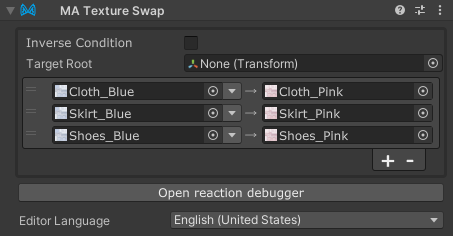

# Texture Swap

The Texture Swap component allows you to swap textures on your avatar with other textures in bulk,
when the Texture Swap component's GameObject is enabled.

Texture Swap is a type of [Reactive Component](./index.md). See that page for general rules and behavior of reactive
components.

## When should I use it?

Texture Swap can be used to swap textures on your avatar in bulk, either directly in response to a menu item, or in
response to some other object appearing or disappearing.

Note that multiple Texture Swap components cannot be applied simultaneously to a single material.

## Setting up Texture Swap

Attach the Texture Swap component to the GameObject that will control its state. This can either be an object that
will be animated to enable/disable it, or it can be on a Menu Item (or a child thereof). You can also attach it to an
object that is always enabled, to swap textures on your avatar at all times.

Next, click the + button to add a new entry.
Drag the texture you want to swap from onto the left texture field,
and drag the texture you want to swap to onto the right texture field.

To limit the scope to a specific hierarchy, you can set "Target Root".

By default, Texture Swap will swap textures when the GameObject is enabled (and/or the associated menu item is
selected). If you want to swap textures when the GameObject is disabled, you can select "Inverse condition".