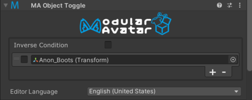

# Object Toggle

The Object Toggle component allows you to change the active state of one or more other GameObjects, based on the active
state of a controlling object.

Object Toggle is a type of [Reactive Component](./index.md). See that page for general rules and behavior of reactive
components.

## When should I use it?

This component is useful to disable one mesh when another mesh is covering it entirely. For example, you might want to
disable an underwear mesh when it's fully covered by other clothing.

## Setting up Object Toggle

Simply add an Object Toggle component to the controlling object, then click the + and select a target object to be
controlled. The checkmark controls whether the target object will be enabled or disabled.
